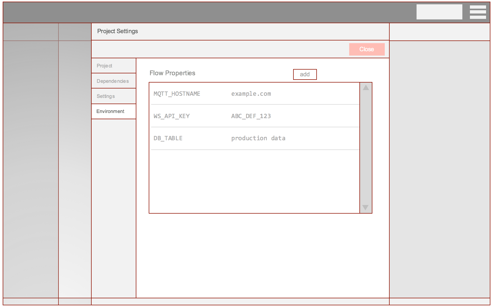
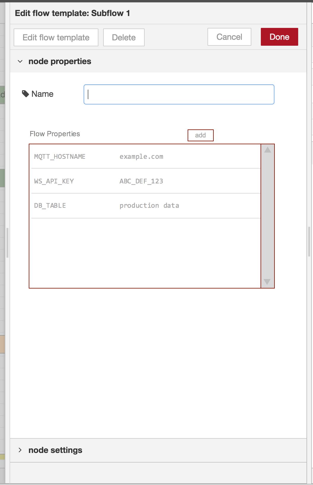

# Environment Variables

## Summary

We currently allow any node configuration property to be set from an environment variable. The node property should be set to a value of `$(ENV_VAR)` and the runtime will insert the value of `ENV_VAR` before passing the configuration to the node.

There are a few other places where we want to enable more flexible configuration of nodes, so it makes sense to pull these threads together.

The basic usability of the `$(ENV_VAR)` approach has issues. It can only be used for node properties that are String types. For example, you can't use it within the Change or Switch node rules as the details of each rule are wrapped up into a single JavaScript Object. It's also not an obvious thing - you need to know about it in order to use it.

 - [x] [Update existing env var syntax](#0-update-existing-env-var-syntax) (_in 0.19_)
 - [x] [Add envvar as option to TypedInput](#1-add-envvar-as-option-to-typedinput) (_in 0.19_)
 - [ ] [Project Settings](#2-project-settings)
 - [x] [Subflow Instance Properties](#3-subflow-instance-properties) (_in dev branch for 0.20_)
 - [x] [Compound Env Vars](#4-compound-env-vars) (_in 0.19_)
 - [x] [JSONata support for env vars](#5-jsonata-support-for-env-vars) (_in 0.19_)
 - [x] [Function node access](#6-function-node-access) (_in dev branch for 0.20_)

## Authors

  - @knolleary

## Details

### 0. Update existing env var syntax

_In 0.19 release_

The current syntax of `$(ENV_VAR)` was loosely inspired by the bash syntax for command substitution. However, JavaScript now supports [Template Literals](https://developer.mozilla.org/en-US/docs/Web/JavaScript/Reference/Template_literals) that use a subtly different syntax: `${ENV_VAR}`

The difference between `$()` and `${}` is a potential source of confusion to new users.

The proposal here is to deprecate (but still support where it's already used) the `$()` syntax in favour of `${}`.

### 1. Add envvar as option to TypedInput

_In 0.19 release_

The first step here is to add Environment Variable as one of the pre-defined types in the TypedInput widget. That will make it a first-class configuration option and can be used with any node property. The `RED.utils.setMessageProperty` function can be updated to support env-var lookup - meaning Switch/Change node rules will be able to use them.

### 2. Project Settings

It should be possible to declare the env-vars a project uses within its settings, along with default values for them. It would then be possible to override the default values using normal env-vars. These would be stored in a project's `settings.json` file. As the values may be credentials, they would need to be encrypted.

#### Project Profiles

Extending the Project Settings idea, we could consider adding the ability to have named profiles for the project. For example, you can define a 'test' profile and associated env-var values, and a 'production' profile with its own values. It should then be possible, through some mechanism (env var, command-line option etc) to tell the runtime which profile to use.

### 3. Subflow Instance Properties

_In dev branch for 0.20_

We've had an item on the backlog for a long time to allow subflow instances to be customised. This could be achieved using the env-var model - where a user is able to set env-var values within a Subflow Instance node's properties that apply only to the nodes within that instance.

### 4. Compound env-vars

_In 0.19 release_

We currently only support using `$(ENV_VAR)` syntax (changing to also support `${ENV_VAR}`) if it is the complete node property - you cannot use `$()` within a longer string. But that would be quite useful to do.

For example, an MQTT node that subscribes to `$(HOSTNAME)/events`. To achieve that today, env vars have to be created for each and every property that needs to be set. It's an okay workaround but can be cumbersome.

The question is whether we can support this sort of compound syntax within the editor.

Within a normal `<input>`, it would just be case of looking for any and all `$(XYZ)` and substituting the corresponding value. The major issue with this approach is that longer properties, such as a Function or Template, are more likely to legitimately want to have `$(FOO)` appear in them without intending to be substituted. This is a real concern and prevents us from adding blanket support for it to all node properties.

With the proposed TypedInput addition we can be more flexible. The question is how to do compound env-vars here - there's no markup to indicate name of env var versus text to concatenate it with. An option would be to require the use of `${FOO}` if needed to delimit the env var.

 - `FOO` - looks up `process.env.FOO` - as this is in context of a declared env-var type, the `${}` is superfluous, except...
 - `${FOO}` - looks up `process.env.FOO`
 - `FOO${BAR}` - looks up `process.env.BAR` and concatenates it to the literal `FOO`

Both the Project Settings and Subflow Instance properties list would also support this format.

This does mean compound env vars would only be possible using these new features - not in any arbitrary node property `<input>`. But a compound env var could be declared in Project Settings of Subflow Instance Properties which is then available as a simple `${NEW_ENV_VAR}` to use anywhere in the flow.

### 5. JSONata support for env vars

_In 0.19 release_

We'll add a new function to our JSONata setup to allow env vars to be retrieved:

    $env('ENV_VAR')

### 6. Function node access

_In dev branch for 0.20 release_

Currently the only way to access env vars in a Function node is to either:

 - import them into global context via `functionGlobalContext`
 - use a preceding Change node to set a message property to `$(FOO)` so the value can be passed in with each message.

These are both unnecessarily onerous on the developer. The `fGC` approach doesn't fit with project/subflow settings concept.

The proposal here is to add a new top-level object in the Function node to provides *read-only* access to env vars.

    let foo = env.get("FOO");

This will work for env vars, project settings and subflow instance properties.

## History

  - 2019-02-26 - migrated from Design note wiki
