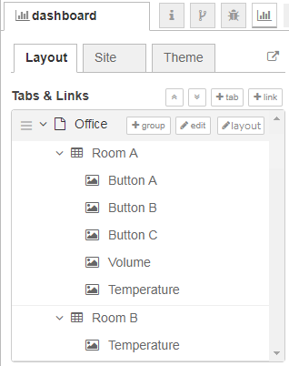
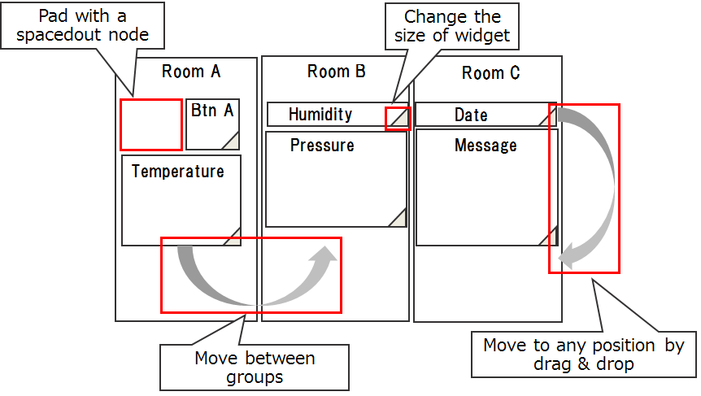

# Dashboard Layout Tool

## Summary
User cannot visually design a layout of dashboard widgets.  This layout tool
will allow a user to deploy dashboard widgets by drag & drop.

## Authors

 - tbd

## Details

There are several requirements that this layout tool should satisfy.

1. Change the order of widgets in a group by drag & drop.
2. Change the size of a widget.
3. Pad `ui_spacer` widgets.
4. Move a widget from one group to the another.
5. (optional) Change the size of a group.

### User interface
To show the layout tool of dashboard, Add `layout` button on the tab menu.

When a user clicks the `layout` button, the window of a layout tool will appear.
It should look like the maximized window of function node.

After a user adjusts the layout on the window:
- If the user clicks `Done` button:
  - inserts `ui_spacer` widget if necessary.
  - updates the layout of sidebar and workspace.
- If the user clicks `Cancel` button, the change will be discarded.

### Future discussion

- Add a node on the layout tool.
- Add/remove a group.

## History

 - 2019-02-27 - migrated from Design note wiki
