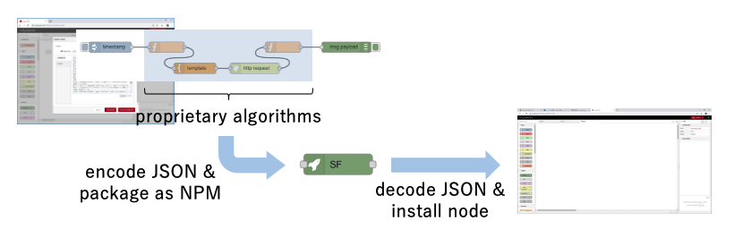

# Encrypting SUBFLOW

This proposal covers how a SUBFLOW can be encrypted when exported as reusable node.

Node-RED flow definitions are currently distributed as JSON data.  This JSON representation exposes algorithms represented in flow.  Thus, flow can be directly  or maniplated by other Node-RED instance that imported the JSON data or inspected manually.

In some cases, Node-RED users do not want their flows to be looked or manipulated by unauthorized users because of intelectual property or other reasons.

This design note aims to address this issue and proposes a flow encryption feature.

### Authors

 - @HiroyasuNishiyama

### Details

The flow encryption function is realized as an extension of the redistribution feature of a subflow node proposed at https://github.com/node-red/designs/blob/master/designs/exportable-subflow/README.md.  In this SUBFLOW redistribution feature proposal, users that import sealed SUBFLOW is not possible to refer to the internals of the SUBFLOW.  However, the internal structure of the SUBFLOW is exposed in the JSON distribution format.  Therefore, the purpose of this design note is to prevent an unauthorized person from referring to the internal representation of a SUBFLOW by encrypting the internal structure of the SUBFLOW.

Re-exporting encrypted SUBFLOW is not allowed.



Since the flow encryption algorithm depends on use case, it should be selected by setting.

#### Encrypted SUBFLOW Representation

Exportable SUBFLOW adopts new flow format.  It embeds an array of nodes within a SUBFLOW in `flow` property.  When encrypting SUBFLOW, set the `flow` property to the following object instead of an array.

|      | name     | type   | description                  |
| ---- | -------- | ------ | ---------------------------- |
| 1    | encoding | string | encoding method              |
| 2    | flow     | string | encoded nodes within SUBFLOW |

The `sealed` attribute of the SUBFLOW must be true when encryption is applied to it.


#### Encryption Mechanism

The Node-RED runtime provides a means for installing functions for encrypting / decrypting flows.  This is specified by `encryptSubflow` property of `settings.js`.  `encryptSubflow` property points to an object with following properties:

|      | name    | type   | description                         |
| ---- | ------- | ------ | ----------------------------------- |
| 1    | methods | array  | encoding methods specifications     |
| 2    | default | string | default encoding specification name |

Encoding method specification is represented by following object:

|      | name   | type     | description             |
| ---- | ------ | -------- | ----------------------- |
| 1    | name   | string   | name of encoding method |
| 2    | encode | function | flow encode function    |
| 3    | decode | function | flow decode function    |

When loading/saving encrypted/decrypted flow, it uses the `encode`/`decode` function with specified name.  The `default` property specifies default encofing method specification. 
**Example:**

```
encryptSubflow: {
    methods: [
        {
            name: "method1",
            encode: function(flow) {
               // code for encoding flow
            },
            decode: function (flow) {
                // code for decoding flow
            },
        },
        ....
    ],
    default: "method1"
}
```

The runtime provides endpoints for encrypting / decrypting SUBFLOW to handle encrypted flows in the editor front end.

#### Limitations

To execute the flow, the Node-RED runtime needs to decrypt the flow.  Therefore, a flow can be acquired by using the corrected runtime.  This design note does not assume that such cases will be addressed.

## History

  - 2020-02-22 - initial design note