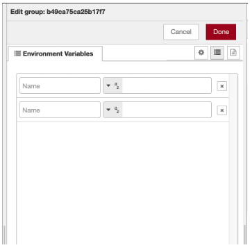
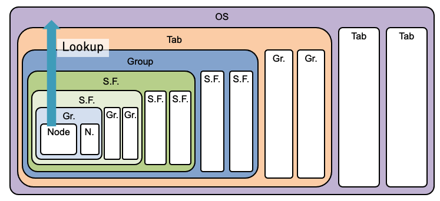

# Environment Variables for Group and Tab

## Summary

Environment variable is useful for customizing SUBFLOW’s behavior. It supports hierarchical propagation from enclosing SUBFLOW to enclosed SUBFLOW.  This means that setting the same value for multiple SUBFLOW instances is difficult without nesting.

Also, there is no direct means for specifying top-level values except OS environment variable.

Thus, this design note proposes ability to define environment variable in groups or tabs. 

## Authors

- Hiroyasu Nishiyama

## UI Extension for Groups and Tabs

We add a new environment variable tab for group and tab settings panel.

It is same as environment variable setting tab for SUBFLOW instance but do not provide UI definition feature for variables.

Environment variable look up from a node is performed in the following order:

1. apply following lookup from inner nodes to outer nodes,
   
   1. if the node is included in a group and the group defines the variable, its value is used, otherwise,
   
   2. if the node is included in a subflow template and the subflow instance defines the variable, its value is used,

2. if lookup of #1 reaches top-level flow,
   
   1. if the tab defines the variable, its value is used, otherwise,
   
   2. if OS defines the variable, its value is used.

Currently, environment variable input interface do not support editing value, this design note also propose adding JSONata expression to typedInput interface to make environment variable editable.

## History

- 2021-07-07 - Initial Design
