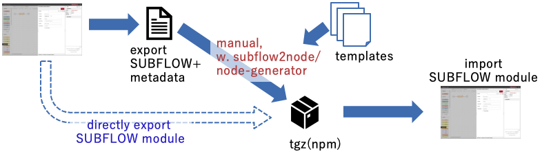
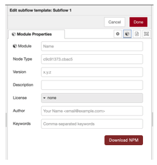
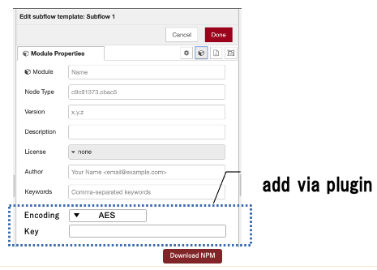

# Editor Support of Exporting SUBFLOW

## Summary

This proposal covers how a SUBFLOW can be exported as a packaged npm module from the editor for reuse elsewhere.  

There are other related design note that covers this topic:

1. [Exportable SUBFLOW](https://github.com/node-red/designs/blob/master/designs/exportable-subflow/README.md)

2. [SUBFLOW Node Modules](../subflow-node-modules.md).

3. [Encoding SUBFLOW](https://github.com/node-red-hitachi/designs/tree/subflow-encryption/designs/encrypt-subflow)

The design of #1 describes original proposal of exporting SUBFLOW using JSON format.

The mechanism for packaging a SUBFLOW as a redistributable npm node module will is covered by #2.  Importing npm packaged subflow module is implemented in Node-RED 1.3.

An npm packaged module can be converted from exported SUBFLOW JSON data manually or with tools support.  So, this proposal covers directly exporting SUBFLOW as a npm packaged module from Node-RED editor.

## Authors

- Hiroyasu Nishiyama

## Editor Support of Exporting SUBFLOW

A button to download npm packaged SUBFLOW (.tgz) will be added to Node-RED editor UI.  If this button is pressed, a dialog for downloading the npm packaged SUBFLOW is displayed.  This file can be installed to another instance of Node-RED using upload button in a panel shown by selecting *Manage palette > Install* menu.

When this button is pressed, a dialog for downloading the 

Possible point to add SUBFLOW export support in Node-RED editor is:

1. module properties tab of of SUBFLOW template, and/or

2. export nodes UI of export menu.

Because users need to modify the module properties when required information are not supplied, we propose adding button in module properties tab as shown below.

### Encoding JSON

Encoding support of JSON flow will be included in the template used for creating NPM module from SUBFLOW and module properties tab of SUBFLOW template settings panel includes specification of encoding.

This encoding will be candidate for application of plugin feature.

### Configurations

Some hosted environment may not want to allow their users downloading SUBFLOW npm module.  To support this, download button is only displayed when `subflowModule.allowDownload` property in `settings.js` is set to `true`.

A path for templates for creating a SUBFLOW can be specified by `subflowModule.templateDir` in `settings.js`.  This directory contains set of files that is used to pack npm module.

### Implementation Notes

Possible approach for implementing this export feature are:

1. call node generator or another external tool from runtime,

2. add new supporting code to runtime.

In this proposal, we assume #2 because use of node generator adds large amount of dependencies with most of them not used for this purpose.  
We may be able to use new  plugin mechanism introduced since Node-RED 1.3 to add this button.  It requires runtime modification, addition of a button, to part of SUBFLOW settings panel and installation of plugins may be difficult for novice users.  So, we assume hard coding this feature in Node-RED editor at present.

## History

- 2021-07-07 - Initial Design Note
