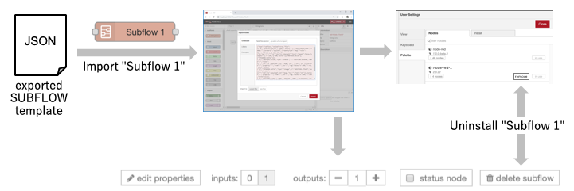

# Exportable SUBFLOW

This proposal covers how a SUBFLOW can be exported from the editor for reuse elsewhere.

They key requirement is that once it is imported, the end user is not aware the node
was implemented as a SUBFLOW - it appears as a regular node in their palette and
they cannot edit the internals.

This design will cover how this could be handled in the editor UI.

The mechanism for packaging a SUBFLOW as a redistributable npm node module will be
covered by [SUBFLOW Node Modules](../subflow-node-modules.md).

This feature *must* also consider the wider enhancements to the Library UX that
are in the roadmap. (*TODO: add a link to the design doc once added*).

### Authors

 - @HiroyasuNishiyama

### Details

Node can be exported as JSON code (*Exported SUBFLOW Template*) or converted to a Node (*SUBFLOW Node*). In this document, design for *Exported SUBFLOW Template* is described.

#### Exporting SUBFLOW Template

By clicking **Export** button on SUBFLOW Template edit tab, SUBFLOW export panel is shown.  In this panel, JSON representation of the SUBFLOW can be downloaded, copied to clipboard, or stored to library.  

#### Importing SUBFLOW Template

SUBFLOW Template represented as JSON data can be imported to other Node-RED environment from import new node panel.

#### Setting Properties for Exproted SUBFLOW Template

Clicking **Edit** button on SUBFLOW Template edit tab or clicking ***Edit** button on SUBFLOW Export panel shows SUBFLOW Template properties edit tab.

In this tab, new node information such as node name, version, etc. can be specified. There is **Include All SUBFLOW** check box on this panel.  If checked, SUBFLOWs used within the exported SUBFLOW are recursively included in exported SUBFLOW Template (default: checked).  

If **Editable** check box on this panel is checked, SUBFLOW template can be edited on imported Node-RED editor (default: unchecked).  Otherwise, the imported SUBLOW template is sealed. Thus, its internal flow or UI definition can not be edited.

If imported subflow is sealed and its **Include all SUBFLOW** is checked, SUBFLOWs used within the imported SUBFLOW are not listed on editor pallette and hidden from users.

#### Uninstalling SUBFLOW Template

Imported SUBFLOW Template are listed in *Manage Palette > Palette > Nodes* tab.  Similar to normal nodes, *SUBFLOW Template*s listed in this tab will have **remove** button.  If a imported SUBFLOW Template includes other SUBFLOW Templates and is sealed, contained SUBFLOW Templates are also deleted.

If imported SUBFLOW template is not sealed, the SUBFLOW template can also be deleted by clicking **delete subflow** button.

### Unknown node in imported SUBFLOW Template

When a sealed SUBFLOW Template is imported, if nodes contained in the template are not installed, imported SUBFLOW template appear with shaded color and dotted line similar to `unknown` node on Node-RED Editor and are disabled.

List of nodes contained in SUBFLOW but not installed can be found in Manage palette/Palette/Nodes list.

#### SUBFLOW Template Export Format

Exported SUBFLOW Template is represented by JSON array format which is similar to current flow representation.  

Following is a list of properties exported SUBFLOW node in SUBFLOW Template may contain (+ means that property is optional):

|      | name    | type   | description                        |
| ---- | ------- | ------ | ---------------------------------- |
| 1    | flow    | array  | array of contained nodes in SUBFLOW |
| 2    | sealed+ | bool   | SUBFLOW template is not editable   |
| 3    | hidden+ | bool   | SUBFLOW template is hidden         |
| 4    | name    | string | name of SUBFLOW Template           |
| 5    | color+  | string | color of SUBFLOW                   |
| 6    | version | string | version of SUBFLOW (format: x.y.z) |
| 7    | author+ | string | author of SUBFLOW                  |
| 8    | license+ | string | license of SUBFLOW                |
| 9    | keywords+ | array  | array of keywords of SUBFLOW     |
| 10   | description+ | string | simple description of SUBFLOW |
| 10   | exportName+ | string | export name of SUBFLOW         |

Exported SUBFLOW Template can be **sealed** which means that internal of the SUBFLOW Template is hidden from users.  

If imported **seald** SUBFLOW Template includes other SUBFLOW Templates, **hidden** property of these templates are set to true and these SUBFLOW Templates are not shown in editor pallette.

For example, suppose SUBFLOW template `S0` uses other SUBFLOW template `S1`.  If `S0` is exported in **sealed** + **include all** mode and, exported JSON representation contains `S0` and `S1`.
If this JSON representation is imported in another Node-RED instance, `S0` (**sealed**) is not editable and shown in pallette list.  `S1` (**sealed** and **hidden**) is not listed in pallette list and only used internally in `S0`.  This is intended to hide SUBFLOWs used as internal parts of exported SUBFLOW from the user.

`flow` property is an array of nodes that are used in its SUBFLOW template.  *id* of nodes in SUBFLOW template must be *name*-*ID* where *ID* is a original *id* of the node.

Extended properties are ignored if they are imported to older version of Node-RED.  

## Implementation Phases

1. Implement basic import & export features including:
	- SUBFLOW Export Panel,
	- Changes to import mechanisms
1. Add support of SUBFLOW Template properties tab,
1. Implement sealing related features including:
	- sealed SUBFLOW import/export,
	- uninstallation of sealed SUBFLOW, 
	- SUBFLOW with unknown node

## History

  - 2019-02-27 - migrated from Design note wiki
  - 2019-07-26 - updated according to design discussion on early July
  - 2019-09-06 - updated accodring to design discussion on Sep. 4th
  - 2019-10-24 - updated description sealed SUBFLOW and add exportName to SUBFLOW property