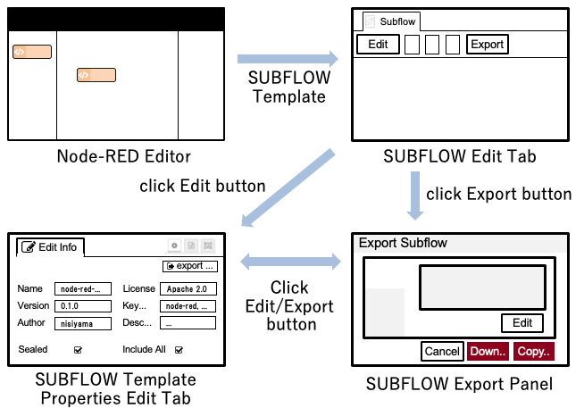
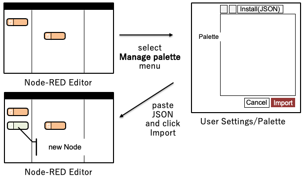

# Exportable SUBFLOW

This proposal covers how a SUBFLOW can be exported from the editor for reuse elsewhere.

They key requirement is that once it is imported, the end user is not aware the node
was implemented as a SUBFLOW - it appears as a regular node in their palette and
they cannot edit the internals.

This design will cover how this could be handled in the editor UI.

The mechanism for packaging a SUBFLOW as a redistributable npm node module will be
covered by [SUBFLOW Node Modules](../subflow-node-modules.md).

This feature *must* also consider the wider enhancements to the Library UX that
are in the roadmap. (*TODO: add a link to the design doc once added*).

### Authors

 - @HiroyasuNishiyama

### Details

Node can be exported as JSON code (*SUBFLOW Module*) or converted to a Node (*SUBFLOW Node*). In this document, design for *SUBFLOW Module* is described.

#### Exporting SUBFLOW Module

By clicking **Export SUBFLOW** button on SUBFLOW template setting panel, SUBFLOW export panel is shown.

In this panel, new node information such as node name, version, etc. can be specified. There is **Include All SUBFLOW** check box on this panel.  If this is checked, SUBFLOWs used within the exported SUBFLOW are recursively included in exported SUBFLOW Module.  If **Editable** check box on this panel is checked, SUBFLOW template can be edited on imported Node-RED editor.  Otherwise, the imported SUBLOW template is sealed. Thus, its internal flow or UI definition can not be edited.

#### Importing SUBFLOW Module

Node represented as JSON data can be imported in Node-RED environment from import new node panel.

#### Uninstalling SUBFLOW Module

SUBFLOW Module are listed in *Manage Palette > Palette > Nodes* tab.  Similar to normal nodes, *SUBFLOW Module*s listed in this tab will have **remove** button.  If a SUBFLOW Module includes other SUBFLOW Modules and is sealed, contained SUBFLOW Modules are also deleted.

#### SUBFLOW Module Format

Exported SUBFLOW Module is represented by JSON array format which is similar to current flow representation.  

Following is a list of properties exported SUBFLOW node in SUBFLOW Module may contain (+ means that property is optional):

|      | name    | type   | description                        |
| ---- | ------- | ------ | ---------------------------------- |
| 1    | flow    | array  | array of contained nodes in SUBFLOW |
| 2    | sealed+ | bool   | SUBFLOW template is not editable   |
| 3    | hidden+ | bool   | SUBFLOW template is hidden         |
| 4    | name    | string | name of SUBFLOW module             |
| 5    | color+  | string | color of SUBFLOW                   |
| 6    | version | string | version of SUBFLOW (format: x.y.z) |
| 7    | author+ | string | author of SUBFLOW                  |
| 8    | license+ | string | license of SUBFLOW                 |
| 9    | keywords+ | array  | array of keywords of SUBFLOW       |
| 10   | description+ | string | simple description of SUBFLOW      |

Exported SUBFLOW Module can be **sealed** which means that internal of the SUBFLOW Module is hidden from users.  

`flow` property is an array of nodes that are used in its SUBFLOW template.  *id* of nodes in SUBFLOW module must be *name*-*ID* where *ID* is a original *id* of the node.

Extended properties are ignored if they are imported to older version of Node-RED.  

## History

  - 2019-02-27 - migrated from Design note wiki
  - 2019-07-26 - updated according to design discussion on early July
