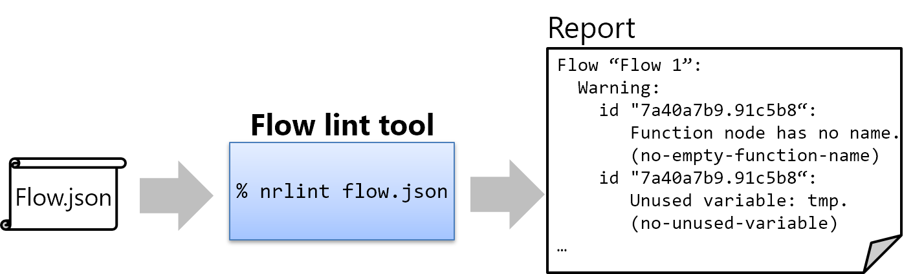
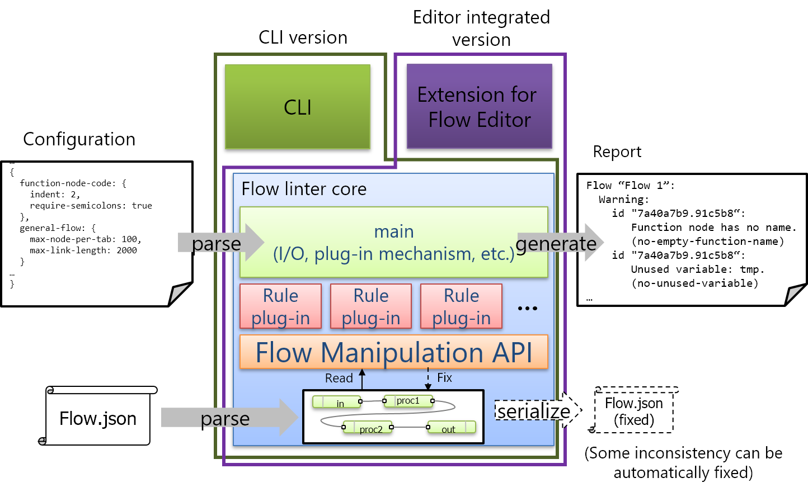
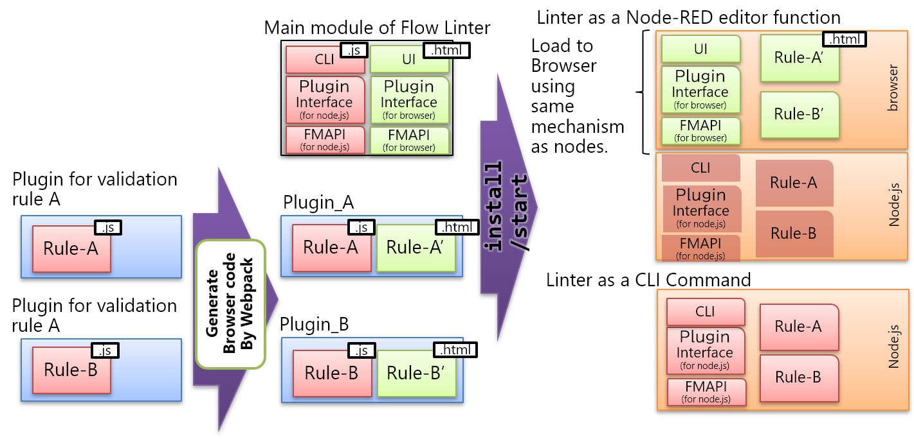

# Flow Linter

## Summary
Node-RED makes it easy to program by wiring nodes together.  But sometimes, because of its less restrictive nature, programmer may write flows that are hard to understand.  For example: 
- Function node that has no name or description.  The reader need to read internal JavaScript code to understand what the node do,
- Excessive amount of nodes in a single flow.

And, some subtle differences in programming style cause readability low.
- Size of flow on Flow Editor
- Grid size
- JavaScript coding style in function nodes.

The flow linter provides a framework that automatically checks whether a flow is compliant with rules and conventions. 

## Authors
 - [@k-toumura](https://github.com/k-toumura)

## Details

### Use cases
- To use the consistent coding rules in a team, the tool checks a flow before submit to a repository.
- To prevent bugs, the tool checks a flow when the programmer requests it, or continuously checks as a background task of Flow Editor. 
  - Editor displays suggestions to user: 'This HTTP-in node doesn't have corresponding HTTP-out node.', 'These nodes in this flow must preserve message properties set by HTTP-in', etc.
- To prevent move/edit/delete node accidentally, some node position or property change can be restricted by rules.

### Requirements / ideas
- There are various rules/conventions, and each organization/community/etc. has different policies on it.  Because of this, the rules has to be pluggable and customizable.
- Linter is used in both batch-style (e.g. command-line interface) and on-the-fly-style (e.g. integrated in Editor).  The core service of linter can be used in both usages.
- Rule configuration can be exported as JSON format and can be included in flow.json so that developers can distribute flow templates with their own restrictions.
- Use compatible format with other linter/tester tools for result output.

### User interface

#### Command-line interface (batch-style)


#### Integrated in Editor (in Sidebar, batch-style)


### Architecture



#### Flow manipulation API
The flow manipulation API provides a highlevel interface to handle flow.json file.
Programmers need not to know about the format of flow.json and structure of flow object.

#### pluggable rules
Developer can create their own rules by writing plug-in module.

Following code shows example of plug-in, that checks existance of name of function node.

```javascript
function check (afs, conf, cxt) {
    var funcs = afs.getAllNodesArray();  // extract all nodes 
        .filter(function(e) {return e.type==='function';}) // filter out unrelated nodes
        .map(function(e) {
            return {id:e.id, name:e.name}; // extract their node id and name
        });
    var verified = funcs
        .filter(function(e) {return e.name === undefined || e.name === "";})// check existance of name
        .map(function(e) {
            return {rule:"no-func-name", id:e.id, result:conf}; // generate result
        });

    return verified;
}

module.exports = {
    check: check
};

```
- Flow-check code in plug-in is used on both CLI (runs on node.js) and Editor (runs on browser).  To use same code in both node.js and browser, there are tools for generate codes for both:
  - [Browserify](http://browserify.org/): get all dependent npm modules and put in one script file.
  - [webpack](https://webpack.js.org/): more general module bundler.
    - Currently plug-in installer uses this to generate Editor-side code, but we should use only on plug-in development phase, and make plug-in user need not to depend the tool.
  - [Babel](https://babeljs.io/): convert modern JavaScript (ES2015+) code to (traditional) JavaScript code that can be executed on various browsers.
    - It is useful but it is very large project, so we should avoid to make dependency with it.
  - [Language Server Protocol](https://microsoft.github.io/language-server-protocol/) defines the protocol used between an editor and a language server that provides language features like lint.  It may be alternative option to implement lint function as a language server embedded in a Node-RED server.
    - Language Server Protocol itself is aimed for line-oriented text programming languages.  It is not suitable for visual programming language like Node-RED.  If we adopt the LSP, We might incorporate only their 'Client-Server' architecture, and not incorporate their protocol or data model.
    - If we adopt this architecture, the linter need not to generate code for server and browser.  But we have to estimate an overhead to send flow object from browser to server.

The code generation mechanism is shown in below.


#### Configuration
Linter reads configuration files in following order:
1. Project-specific configuration: $HOME/.node-red/project/projectname/nrlint.js
2. Per-user configuration: $HOME/.node-red/settings.js

3. Command-line argument: nrlint --config nrlint.js / node-red --lintconfig nrlint.js

If there is a conflict between them, latter definition overrides former one.

- File format: in settings.js
```json
    ...
    "nrlint": {
        "rules": {
            "no-func-name": "warn",
            "func-style-eslint": { semi: 2 }
        }        
    },
    ...
```
- in separate nrlint.js file
```javascript
module.exports = {
    "rules": {
        "no-func-name": "warn",
        "func-style-eslint": { semi: 2 }
    }
}
```

#### Report format
- should be similar format with other linting tools (e.g. ESlint, JShint, ...)

#### Other Consideration
- When validation is invoked in Editor, validation codes should be executed in editor.  API call to server-side is expencive, and it is need to add extra adminAPI in the core.

### Implementation plan

#### First step
- Implement a mock-up prototype of plug-in architecture
- Implement CLI version
  - Considering future extention, e.g. use from Flow Editor, on-the-fly checking, etc. 

#### Next steps
- Implement Editor-integrated version (in Sidebar, batch-style)
- Rule configuration UI
- Make rules be exported as JSON format and can be included in flow.json so that developers can distribute flow templates with their own restrictions.
- On-the-fly checking in Editor


### Related works
- [Design: Flow Manipulation API](https://github.com/node-red/designs/tree/master/designs/flow-manipulation-api)

## History
- 2018-12-21 - Initial proposal submitted on [Design note wiki](https://github.com/node-red/node-red/wiki/Design:-Flow-Linter)
- 2019-03-06 - migrated from Design note wiki
