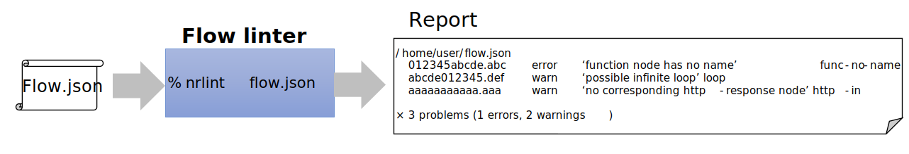
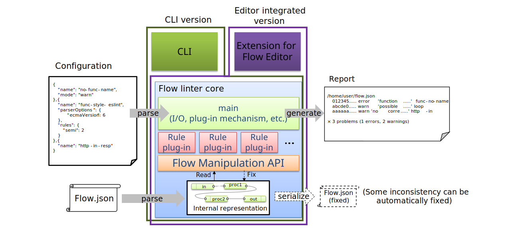

# Flow Linter

## Summary
Node-RED makes it easy to program by wiring nodes.  But sometimes, because of its less restrictive nature, programmer may write flows that are hard to understand.  For example: 
- Function node that has no name or description.  The reader need to read internal JavaScript code to understand what the node do,
- Excessive amount of nodes in a single flow.

And, some subtle differences in programming style cause readability low.
- Size of flow on Flow Editor
- Grid size
- JavaScript coding style in function nodes.

The flow linter provides a framework that automatically checks whether a flow is compliant with rules and conventions. 

## Authors
 - [@k-toumura](https://github.com/k-toumura)

## Details

### Use cases
- To use the consistent coding rules in a team, the tool checks a flow before submit to a repository.
- To prevent bugs, the tool checks a flow when the programmer requests it, or continuously checks as a background task of Flow Editor. 
  - Editor displays suggestions to user: 'This HTTP-in node doesn't have corresponding HTTP-response node.', 'These nodes in this flow must preserve message properties set by HTTP-in', etc.
- To prevent move/edit/delete node accidentally in Editor, changing position or property of node can be restricted by rules.

### Requirements / ideas
- There are various rules/conventions, and each organization/community/etc. has different policies on it.  Because of this, the rules has to be pluggable and customizable.
- Linter is used in both batch-style (e.g. command-line interface) and on-the-fly-style (e.g. integrated in Editor).  The core service of linter can be used in both usages.
- Rule configuration can be exported as JSON format and can be included in flow.json so that developers can distribute flow templates with their own restrictions.
- Use compatible format with other linter/tester tools for result output.

### User interface

#### Command-line interface (batch-style)

Stand-alone command, which reads a flow.json file and generate a verification result to standard output
(like a ordinal `lint` command).


#### Integrated in Editor
Linter can be integrated in the Editor.

We are considering following two pattern for user interface: batch and on-the-fly.

After we have the core design of the linter settled, we
will consider more detailed design work, such as
how the linter will be exposed in the editor.

##### Batch
In batch style, an user pushes a button in linter sidebar
to start linting.  This pattern requires processing power
only when the user want to check the flows.  But the
user explicitly push the button to check the flows.


##### On-the-fly
In on-the-fly style, the Editor automatically checks
the flows when user updates some part of flows.
This pattern need no intervention of a user, but
each update of a flow causes validation processes.


### Architecture



Outline of main routine of flow linter:

1. Read a configuration from a designated config file or `nrlint` property in setting.js  
2. Determine which rule plug-in should be loaded based on the configuration.
3. create an internal representation (FlowSet object) from flow.json file or flow object in editor.
4. Loading rule plug-in modules.
5. for all plug-ins, call check() function with FlowSet object, configuration, and context.
   Each check() function is called in the order of appearance in configuration file.
   Returned context from a rule plug-in are passed to argument of next rule plug-in.
6. Consolidate results and a context, and display the result to console, side-bar, etc.

#### Rule module
We use a npm module mechanism to extend validation rules.

- The 'core' plug-in module implements rules which are commonly used in any users.
- The optional plug-in modules implement rules which are not commonly used or complex rules which require larger memory/computational footprints.

To implement a rule npm module for both of CLI and editor, developer can use a code
generation mechanism based on Webpack. 


Rule developer writes their own rule in single JavaScript file, and put it on
rule plug-in framework (which will be provided in flow linter project repository).
These files composes an npm package, and it can distributed among users.
When an user installs the package, an installation script generates
an HTML file which contains a converted JavaScript code and UI elements for Editor.

If the user installs the package globally (i.e. with `-g` option), the original
rule code is used for CLI linter command.  If the user install the package into 
Node-RED's user directory (`~/.node-red` or another directory which is designated by
`-u` option of node-red command),  Node-RED runtime automatically loads the
package as a Node-RED node module, and generated code in HTML file is invoked in Editor.

Currently, our prototype code uses a plug-in mechanism for Node-RED nodes.
This mechanism is somewhat tricky and hacky, so we are planning to design a more generic
plug-in mechanism of Node-RED. 

#### Flow manipulation API
The flow manipulation API provides a high-level interface to handle a flow.
Programmers need not to know about the format of flow.json or structure of flow object in editor.

Note that the Flow Manipulation API doesn't replace current flow operation functions in Node-RED
editor or runtime.  The API provides a abstract view to a flow, regardless of whether a target flow
is in editor, or a file on the filesystem.


Flow Manipulation API is composed of following three categories.

- Creation of FlowSet object: A FlowSet object is created from a flow.json file/string or flow objects which are managed in Flow Editor.
  - `FlowSet.parseFlow()`
  - `FlowSet.copyFlow()`

- Manipulation of a flow via FlowSet object: All of manipulation functions can be used through a FlowSet object.
  - `FlowSet.prototype.getAllNodesArray()`
  - `FlowSet.prototype.get{Node/Flow/Config/Subflow}()`
  - `FlowSet.prototype.{next/prev}()`
  - `FlowSet.prototype.{downstream/upstream/connected}()`
  - `FlowSet.prototype.{insert/remove}()`
  - (update operations are under consideration)

- Exporting a FlowSet object: FlowSet object can be exported to a file, or merging into editor's flow information.  
  - (under consideration)

For linter, we are now focusing on improving read and search interfaces. 

#### pluggable rules
Developer can create their own rules by writing plug-in module.

Plug-in module includes single function `check`,
and it takes following three arguments:
- complete flow set (instance of FlowSet, which implements Flow Manipulation API)
- configuration object for linter 
- context: any object to control rule validation process

The function returns an array of results and a (modified) context.
Each result object contains following information
- result: array of verification results of this rule
  - rule: (String) rule plugin name.
  - ids: array of node IDs which violate the rule.
  - name: (String) rule name.
  - severity: "error" or "warn"
  - message: (String) description of a violated rule.
- context: updated context 

Following code shows example of plug-in, that checks existence of name of function node.

```javascript
function check (afs, conf, cxt) {
    var funcs = afs.getAllNodesArray();  // extract all nodes 
        .filter(function(e) {return e.type==='function';}) // filter out unrelated nodes
        .map(function(e) {
            return {id:e.id, name:e.name}; // extract their node id and name
        });
    var verified = funcs
        .filter(function(e) {return e.name === undefined || e.name === "";})// check existence of name
        .map(function(e) {
            return {rule:"no-func-name", ids: [e.id], severity: "warn",
              name: "no-func-name", message: "function node has no name"};
            // generate result
        });

    return {result: verified, context: cxt}; // context is not modified, just pass through
}

module.exports = {
    check: check
};
```

#### Configuration
Linter reads configuration files in following order:
1. Project-specific configuration: $HOME/.node-red/project/projectname/nrlint.js
2. Per-user configuration: $HOME/.node-red/settings.js
3. Command-line argument: nrlint --config nrlint.js / node-red --lintconfig nrlint.js

If there is a conflict between them, latter definition overrides former one.

- File format: in settings.js
```json
    ...
    "nrlint": {
        "rules": [
            {
                "name": "no-func-name",
                "mode": "warn"
            },
            {
                "name": "func-style-eslint",
                "parserOptions": {
                  "ecmaVersion": 6
                },
                "rules": {
                  "semi": 2
                }
            },
            {
                "name": "http-in-resp",
            }
        ]
    },
    ...
```
- in separate nrlint.js file
```javascript
module.exports = {
    "rules": [
        {
                "name": "no-func-name",
                "mode": "warn"
        },
        // ...
    ]
}
```

#### Report format
- under consideration.
  - should be similar format with other linting tools (e.g. ESlint, JShint, ...)

#### Other Consideration
- When validation is invoked in Editor, validation codes should be executed in editor.  API call to server-side is expensive, and it is need to add extra adminAPI in the core.
  - However, managing two versions (for browser and for server) of validation codes is cumbersome process,
    even if we can use some automatic generation mechanism.  Discussion about this is moved to Appendix.

### Implementation plan

#### First step
- Implement CLI version
  - stabilize APIs for flow manipulation.

#### Second step
- Implement Editor-integrated version (rule validation in Server, batch style)
  - Implement a mock-up prototype of plug-in architecture
  - Add UI element for linter side-bar.
  - To check, push a button on the side-bar.  Results is also displayed in it.
    - Internally, this calls a server-side private API endpoint for linter (`POST /linter`),
      and the endpoint calls CLI version of linter, then linter returns
      result in a JSON format. 

#### Next steps
- Implement Editor-integrated version (rule validation in Editor, on-the-fly) 
  - rule codes in Editor are generated automatically, or are written by hand.
  - Rule configuration UI
  - Make rules be exported as JSON format and can be included in flow.json so that developers can distribute flow templates with their own restrictions.

### Related works
- [Design: Flow Manipulation API](https://github.com/node-red/designs/tree/master/designs/flow-manipulation-api)

## Appendix: Automatic generation of browser-side code from server-side code
- Flow-check code in plug-in is used on both CLI (runs on node.js) and Editor (runs on browser).  To use same code in both node.js and browser, there are tools for generate codes for both:
  - [Browserify](http://browserify.org/): get all dependent npm modules and put in one script file.
  - [webpack](https://webpack.js.org/): more general module bundler.
    - Currently plug-in installer uses this to generate Editor-side code, but we should use only on plug-in development phase, and make plug-in user need not to depend the tool.
  - [Babel](https://babeljs.io/): convert modern JavaScript (ES2015+) code to (traditional) JavaScript code that can be executed on various browsers.
    - It is useful but it is very large project, so we should avoid to make dependency with it.

- [Language Server Protocol](https://microsoft.github.io/language-server-protocol/) defines the protocol used between an editor and a language server that provides language features like lint.  It may be alternative option to implement lint function as a language server embedded in a Node-RED server.
    - Language Server Protocol itself is aimed for line-oriented text programming languages.  It is not suitable for visual programming language like Node-RED.  If we adopt the LSP, We might incorporate only their 'Client-Server' architecture, and not incorporate their protocol or data model.
    - If we adopt this architecture, the linter need not to generate code for server and browser.  But we have to estimate an overhead to send flow object from browser to server.


## History
- 2018-12-21 - Initial proposal submitted on [Design note wiki](https://github.com/node-red/node-red/wiki/Design:-Flow-Linter)
- 2019-03-06 - migrated from Design note wiki
- 2019-12-19 - update document structure, and update description of plug-in and API.
- 2020-04-27 - Plug-in mechanism
- 2020-06-01 - Update implementation plan

