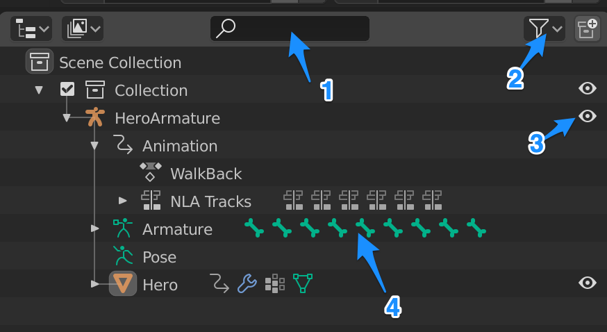
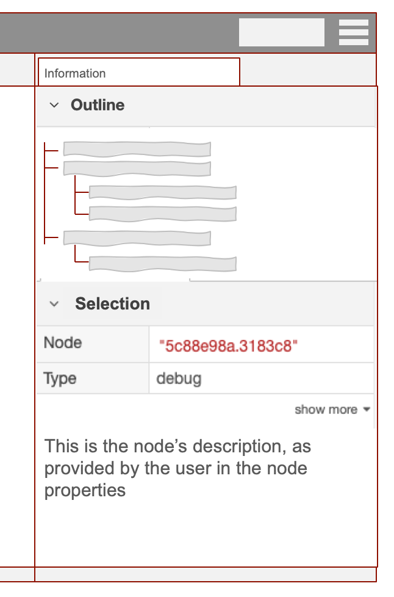
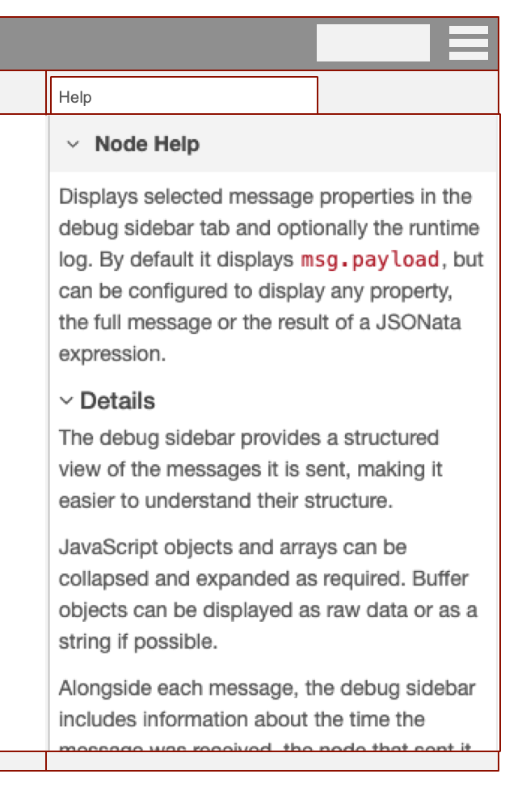

# Flow Outliner

## Summary

A common piece of feedback in the 2019 Developer survey was better ways to navigate
and manage tabs within the editor. There are related issues with the general
visibility of the entities in a flow - config nodes, subflow definitions etc.

This design is for a new Sidebar component that provides a tree-view of the entire
flow configuration.

### Summary of changes

 - New tree-view of flows (`Outline`) is added to the top of the Info sidebar
 - The Outline tree view provides:
   - easy navigation - clicking on an entry will reveal it in the editor
   - double-clicking on an entry will open its edit dialog
   - search and filtering of the tree view
 - The `Node Help` section of the Info sidebar moves to a new `Help` tab
 - A button is added to all node edit dialogs to open the help for that node

## Authors

 - Nick O'Leary

## Details

### Use Cases

1. A user has a large number of tabs - more than fit in the visible tab bar. Scrolling
   the tab bar is slow, particular when they want to jump from either end of the
   tab list. The tab-list search button helps, but requires multiple clicks.

2. A user wants to search for something repeatedly. The current search box forgets
   the latest search as soon as a result is clicked on or the search box closed.

3. A Subflow cannot be exported unless an instance is first added to the workspace
   and that is used to export.

### UI Design

The design for this sidebar is inspired by the Outliner view in Blender:

It provides the structure tree view of all objects in the file. Along with:

1. a search bar
2. an option to filter the view
3. options to toggle visibility
4. for a collapsed item in the tree, info on what the item contains

The Outliner in Node-RED will follow a similar approach.

This new component will be added to the Information sidebar.

To make room for it, the current Node Help section will move to a new "Help" tab.
To ease concerns over the Help being moved off the default sidebar tab, a button
will be added to all edit dialogs to open the help for the node being edited.

## History

- 2020-01-20 - Initial proposal
