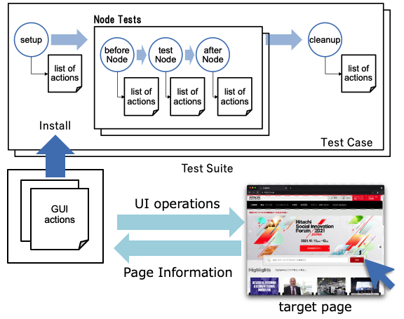
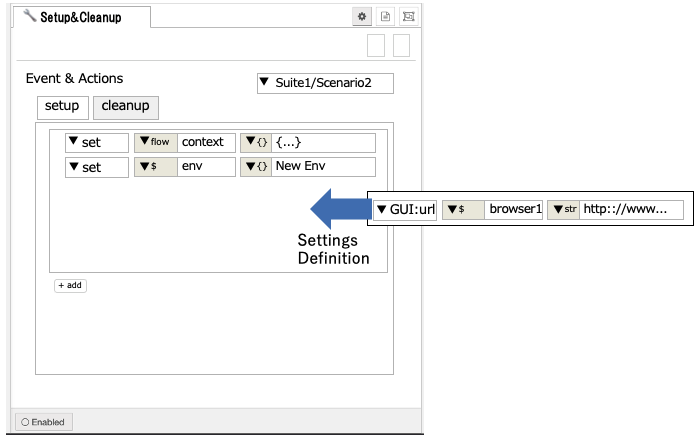

# Flow Testing - Extensions & GUI Testing

## Summary

 This document defines a feature for extending the flow testing plugin of Node-RED discussed in [this GitHub issue](https://github.com/node-red/node-red-flow-tester/issues/1) (and also [this design note](https://github.com/node-red/designs/pull/52)).   In this document, its application to the GUI testing also described.

## Authors

- Hiroyasu Nishiyama
- Kazuhiro Ito

## Design

### Summary of Flow Test Feature

The currently proposed flow testing feature provide the following test features within the Node-RED editor.

- A user can define a set of named **test suites** that consist of individual **test cases**

- Each test case can be configured with desired setup/cleanup phase:
  
  - **setup** - this phase is triggered when test starts. This phase
    can be used to setup environments for test execution. For
    example, preparing a data file used for
  
  - **cleanup** - this phase is triggered when test ends. This phase
    can be used to cleanup environments for test execution.

- For each test case, every node can be configured with a desired behaviour. This will be split into three phases:
  
  - **beforeNode** - triggered when a node receives a message, but *before* the node is given the message. This phase can be used to validate the message arriving. In this phase, the test can:
  
  - **testNode** - this phase, if defined, is used *instead* of the actual runtime node. This allows the node to be stubbed out, for example a node that writes to database or interacts with an external system.
  
  - **afterNode** - triggered whenever the node sends a message, but *before* the next nodes receive it. This phase can be used to validate the message(s) being sent by the node.

These phases are defined as events for the test components. And each event defines a list of actions that are triggered by the event detection. The following are default actions provided by flow testing plugin:

- **wait** - wait for specified time,

- **set** - set message properties, environment variables or context values,

- **match** - match message properties,

- **send** - pass input message to output port,

- **recv** - receive message from input port,

- **function** - execute JavaScript code for complex preparation and checking,

### Extending Flow Testing

For the flow test feature, we provide the ability to add and extend actions for test events via plugin.  

Each extended action provides following properties to the flow testing:

- **name** - name of the action,

- **event** - set of test target event,

- **execute** - a callback function that execute test actions. returns a promise for checking the result,

- **onTestStart** - a callback function that before execute test actions. returns a promise for test initialize,

- **onTestEnd** - a callback function that after execute test actions. returns a promise for test cleanup,

- **UISetup** - a callback function that builds settings UI in actions list.

  

## Extension for GUI Applications Testing

This chapter defines actions extension of flow testing for GUI applications testing.  

GUI testing feature is useful in the following cases:

1. Testing Node-RED editor UI including node settings,

2. Testing the Node-RED dashboard GUI,

3. Testing Web UI not limited to Node-RED flows.

### GUI Actions

GUI testing extension adds following actions which follow subset of [WebDriverIO](https://webdriver.io/) APIs:

- **GUI-URL** - open URL as target
  
  - *target* - name of browser instance,
  
  - *url* - URL of target page, 
  
  - *size* - windows size (optional)

- **GUI-Keys** - send key sequence

  - *target* - name of browser instance,

  - *key* - array of keys to send

- **GUI-saveScreenshot** - Get screenshot of target page
  
  - *target* - name of browser instance,
  
  - *url* - URL of target page (optional),

  - *filepath* - path to the generated image (.png suffix is required)
  
- **GUI-setCookies** - set cookies of target page
  
  - *target* - name of browser instance,
  
  - *cookie* - cookie definition

- **GUI-setTimeout** - set timeout of browser session
  
  - *target* - name of browser instance,
  
  - *timeout* - timeout value (Object containing session timeout values),  
    see WebDriverIO [setTimeout](https://webdriver.io/docs/api/browser/setTimeout/) 

- **GUI-waitUntil** - wait until condition is fulfilled
  
  - *target* - name of browser instance,
  
  - *selector* - element selector,
  
  - *value* - element value or regexp,

  - *timeout* - timeout value(ms)
 
- **GUI-addValue** - add a value to object
  
  - *target* - name of browser instance,
  
  - *selector* - element selector,
  
  - *value* - value to add

- **GUI-clearValue** - clear input value of target
  
  - *target* - name of browser instance,
  
  - *selector* - element selector

- **GUI-click** - click mouse button on DOM-element
  
  - *target* - name of browser instance,

  - *selector* - element selector,
  
  - *kind* - kind of click (single, double)

- **GUI-getValue** - get an value of DOM-element
  
  - *target* - name of browser instance,
  
  - *selector* - element selector,
  
  - *kind* - attribute, property, tag, text, or value,
  
  - *loc* - location to store value (global or flow context)

- **GUI-moveTo** - move mouse position to specified DOM-element
  
  - *target* - name of browser instance,
  
  - *selector* - element selector

- **GUI-setValue** - set value of specified DOM-element
  
  - *target* - name of browser instance,
  
  - *selector* - element selector,
  
  - *value* - value to set

## History

- 2022-02-10 - Initial proposal
