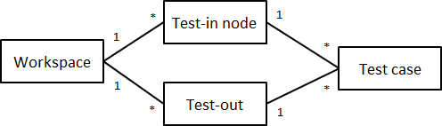
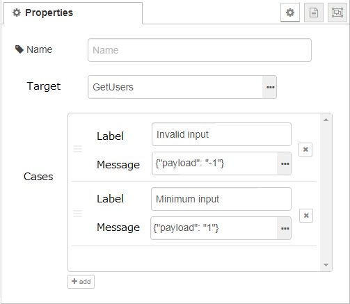
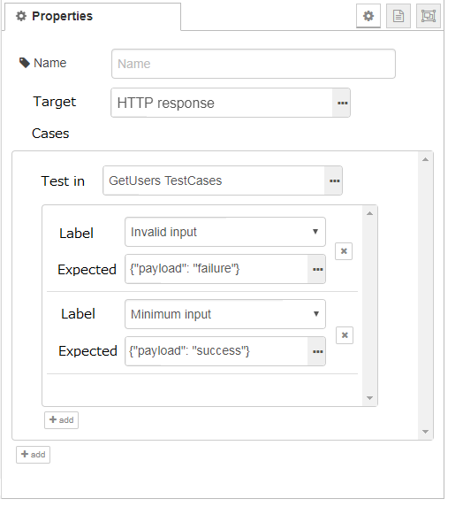
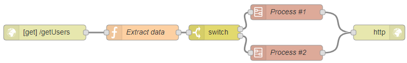
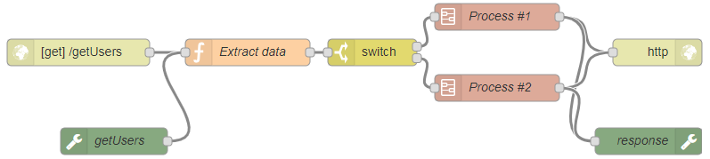
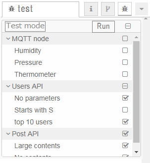

# Flow Testing

## Summary

Node-RED project already provides the tools for testing:
- [Runtime](https://github.com/node-red/node-red/wiki/Testing)
- [Node](https://github.com/node-red/node-red-node-test-helper)
- [Editor](https://github.com/node-red/node-red/wiki/UI-testing) (under development)

This design note focuses on realizing flow testing.

## Autohrs

 - @k-nakanishi
 - @YumaMatuura

## Details

### Requirements
Basic requirements of this tool are as follows.
- Node-RED user can test flows without programming.
- Node-RED uesr can see the test results on the editor.
- Node-RED developer can test flows with CLI.
- It should test the original flow as is.  If it tests a copied flow of the original one, sync problem will happen.

### Usecase
1. Node-RED user does regression testing for the existing flows when updating Node-RED or services that connect with Node-RED.
1. Node-RED automatically runs a test on Travis CI when pull request was posted.

#### User interface
##### Test node
There are two new nodes called test-in node and test-out node.  Test-in node sends a mock message on behalf of the actual input node such as http-in node.  Test-out node receives a message on behalf of the actual output node such as http-response node.  Test-in node and test-out node can handle multiple test cases.



The requirements of test node are as follows.
- Do nothing when it is NOT in a testing mode.
- Appear only in a testing mode.
- Substitute input node and output node in a testing mode. (named as `shadowing`)

##### test-in node
Test-in node specifies one or more test cases so that one test-in node can run multiple test cases.



- Target
  - Specifies a target node to be substituted by a test-in node.
  - When you click the link on the right, all nodes except for test nodes will be shown.
- Cases
  - Specifies test cases.  You can add a test case by clicking `add` button.
  - Each test case has `Label` and `Message` properties.
- Label
  - Describes the name of the test case.
- Message
  - Describes the properties of a message.
  - Although it would be nice to specify each message property on GUI, simply specifying JSON data is a good starting point for the first version.
  - Some properties such as `msg.req` of http-in node cannot be completely expressed with JSON.  This is a fundamental restriction of flow testing.

##### test-out node
Test-out node verifies whether the received message is exactly the expected value or not.



- Target
  - Specifies a target node to be substituted by a test-out node.
  - When you click the link on the right, all nodes except for test nodes will be shown.
- Cases
  - Specifies one or more test-in nodes.  In each test-in node, one or more test cases can be specified.
- Test in
  - Specifies a test-in node corresponding to this test-out node.
  - When you click the link on the right, all test-in nodes will be shown.
- Label
  - Selects a label that the specific test-out node has.
  - When you click the list, show all labels in the test-in node.
- Expected
  - Describes the expected property value of a message.
  - In the case that the test-out node receives a message without specifying the case here, the test will result in failure.

#### Testing mode
As described in test node section, Node-RED needs to change the mode from production to testing, and vice versa.

##### Difference of mode
Assume that the following flow is a testing target.



To test the above flow, change a mode to testing mode, and add test-in node and test-out node.



To express the substitution with testing nodes, there are several design options.
- Surround substituted nodes by a dotted line.
- Connect a wire between substituted node and test in/out node (when clicked).

##### Switch the mode
A user can see only the original flow without test nodes if Node-RED provides the functionality switching a mode.  This may not be necessary for the first version.
To realize the switch, the following implementation is necessary.
- Add a `test` tab on the sidebar
- Add a button to switch the mode on the `test` tab.
  - Although changing the mode right after opening a `test` tab is an option, that cannot notify to runtime server.

#### Sidebar
User can do the following actions on test sidebar.
- Click `test mode` button to enable testing mode.
- Choose test cases to run.
- Click `Run` button to start testing.
- See the result of each test case.




### Development
#### Flow data
Need to consider how to store the information of test nodes.  There are two options.
Option 1 is to store into flow.json. Option 2 is to create a new file test.json.

- Option 1 (flow.json)
  - Easy to share flow data including test data.
  - Data size will get larger since the test data contains JSON data.
- Option 2 (test.json)
  - Can divide production code and test code.
  - Need a function for storage API to load a new file.

#### Test driver
Needs additional discussion about which test driver should be used.  If it is possible to show test results on the sidebar using Mocha, using Mocha would be good.  Otherwise, we may need to implement test driver by ourselves.

#### Examination
When comparing the actual data and expected data, we need to consider the following cases.
- If the property in `msg` is specified in expected object, the property will be compared.
- If the property in `msg` is not specified in expected object, the property will be ignored.
  - This case always happens because `msg` object contains a random ID.
- If the property in expected object does not exist in `msg`, the test case will be failed.

#### Settings
This flow testing feature should be turned on/off. Add a flag in settings.js. The default value is false (turn off).

### CLI
This flow testing needs to be run on the CLI for targeting to run automatically on Travis CI when receiving a pull request on GitHub.
When running a command like `grunt test-flow`, Node-RED runs flow testing then outputs each result such as the existing Mocha tests.
- Run flow test.
```
grunt test-flow --testItem="./item.json"
```

- Command line argument.
  - --testItem : Specify the json file for which the test target "test-in node ID" and "Label" are set.

  - Example: item.json
```
[
    {
        "id": "a9890736.34f478", // Test in node ID.
        "labels": [                   // Label specified for test in node.
                     "Test Case 01", 
                     "Test Case 02"
        ]
        
    }
]
```
- Target:
  - Flow to be tested is `flow<hostname>.json` in user directory.

## History

 - 2019-04-02 - migrated from Design note wiki
 
