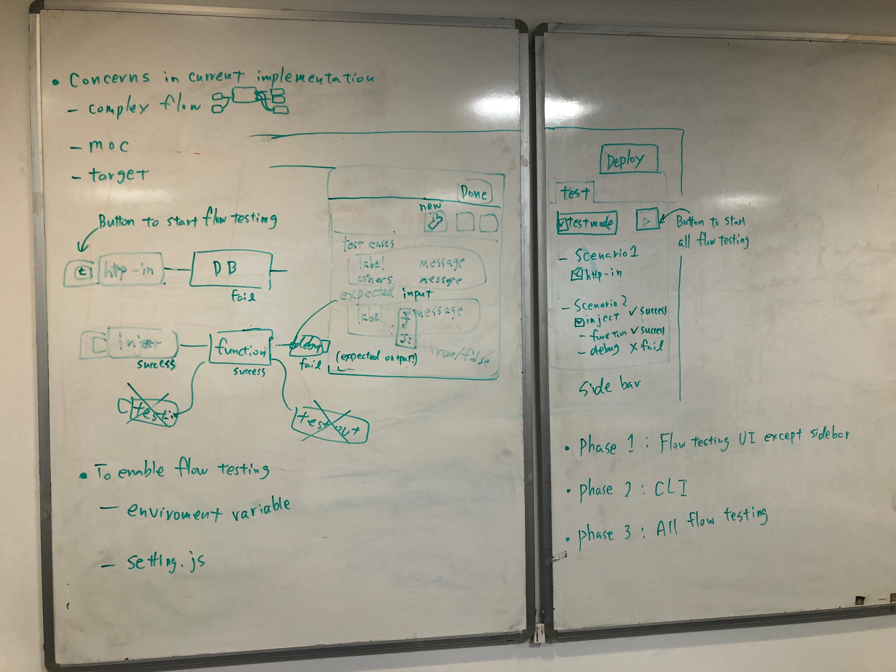

# Flow Testing

## Summary

 This feature allows a flow developer to create test cases for their flows that can be run within the editor or by a CLI tool.

 Within each node, the developer defines a series of test cases.
The test case can describe:

- what message the node should send.
  - if this node is at the start of a flow, this message will be sent when the test case is run.
  - if this is a node in the middle of a flow, the message will be sent when the node receives an incoming message. This will by-pass the internal logic of the node. This allows the node to be stubbed out. It should also be possible to define a message to send when the test case is started - this will allow a test case to begin at any point in the flow
- what message the node expects to receive.
- some way of saying if an error is expected to be reported by the node for a given test case.

## Authors

- Kazuhito Yokoi
- Yuma Matsuura
- Brian Innes

## Requirements

In traditional programming there are many test frameworks and the functionality needed to property test code is quite well understood (visit [Mocha](https://mochajs.org) to see the typical features offered by a Javascript test framework).  However, the use of test tools in low-code development environments is less well defined, but the need for a thorough testing capability still exists.

This design should deliver the following features/functionality:

- The testing function should be able to be run from within the Node-RED editor or from a command line, so testing can be run as an automated delivery pipeline
- The tests should be created using low-code methods, similar to how applications are created using Node-RED.  Ideally creating test cases should not be a coding activity
- There should be the ability to create a "test suite", containing multiple test scenarios rather than a single test
- Test definitions/implementation should not alter a flow in any way that will impact the functionality or performance during normal running

### Areas for debate/resolution

- Should the testing of a function node have more advanced features, such as testing doubles (stubs and mocks)?
- How should sub-flow testing be performed?  As node/flow tests in the sub-flow editor or as a node within a main flow?
- How should input node timed/repeat configuration work during test - disabled and let the test explicitly drive all testing or let input node drive testing?

### Single Node testing

A single node should be able to be tested in isolation.  Certain nodes, such as the function node or the change node, can contain significant amounts of functionality which may need testing in isolation (similar to unit tests in a traditional programming environment).

- The test specification should permit some setup to occur before testing starts, such as setting environment variable or initialising context objects
- tests should run by sending a specified object to the node under test then requiring a set of 'assertions' to be met:
  - output exactly matched object(s) defined in the test definition
  - output contained or did not contain a property(s) or property value(s)
  - same as previous 2 bullets, but node generated specified output on a specific output connector (multiple output connections on node)
  - node generated *n* output messages on an output connector
  - node threw an exception

### Flow testing

Rather then testing a single node the flow test will test a flow as a whole.  Here an input node in the flow will be selected as the starting node for the test and an object will be specified to originate from the starting node.  This will allow the flow to be tested end to end.

- The test specification should permit some setup to occur before testing starts, such as setting environment variable or initialising context objects
- The test defines the starting node and the message the starting node will output
- The test can override the configuration properties of any node in the flow for the duration of the test
- The test can specify the same assertions available to the single node test (input message is exactly *{...}* or input message contains property *x* and property *x* has value *y*, ...) for any nodes in the flow, and optionally specify if the node should be run or not. (E.g. a database write node should not actually write to a database, but the test should verify the data arriving at the node would result in the correct database record being created)
- Any node in the flow can be '*stubbed*' to provide canned responses rather than running the node (E.g. a database lookup node can be stubbed to provide a specific response during a test rather than relying on the target database having valid data to match a test scenario)

### Out of scope of this design

This design will not handle any front end testing (dashboards) or Node-RED node development.  The scope of testing is limited to messages passing between nodes in a Node-RED flow at runtime.

## Design

The rest of this document sets out the proposed design of the testing feature.

## Flow testing UI on each node property UI

To use the flow testing UI, there's a newly wrench button next to the node property button, node description button and node appearance button on the node property UI.
Because each node has test UI inside the node itself, we can avoid spaghetti flows which consist of a lot of nodes and wires for testing.
And obviously, users can easily understand the target node without pointing from other nodes for testing.
Additionally, users can set the default messages in the UI when the node behaves mock node.

 The photo of the idea

 Flow testing UI has the following two `editableList` UI.

- Outputs for test cases
  - Label: Mainly it is for test scenario name. The area has `typedInput` to select String or 'default'. If String is selected, users can input the scenario name in the area. On the other hand, when `default` is selected, the messages specified in the message area will be sent as mock handling.
  - Message: JSON data to send the next node in the flow
- Expected inputs
  - Label: Test scenario name corresponds to the label specified in test cases `editableList`
  - Message: JSON data which will be checked whether the received message equals expected JSON data. The area has `typedInput` to select JSON or JSONata expressions.

In the case of JSONata expression to check expected inputs, the functionality evaluates whether the expression using received messages is true or false.
The following JSONata expressions are examples to check input values.

- Timestamp: `1500000000000 < payload and payload < 3000000000000`
- Specific key, 'age': `'age' in $keys(payload)`
- Array length, 5: `$count(payload) = 5`
- Lower alphabets only: `$exists($match(payload, /^[a-z]+$/))`

When all expected inputs are valid, each node show "success" in the bottom of the node as the status message.
Otherwise, the status has "fail" and an array of scenario names that failed in the test (e.g. "fail: ['test1']").

## Catching error

 In the test mode, each node internally catches the errors from node.error() and report to the flow testing framework.
For users, they can be aware of the error from the node status or test tab on the sidebar.
If there's a catch node in the flow to catch the error, the node throws an error as same as default behaviors.

## Testing tab in the sidebar

The testing tab is located in the sidebar of the flow editor.

- Test mode button: The button to turn on/off the flow testing mode for flow editor
- Execute button: the button to start test cases
- Scenario tree: The tree view consists of a scenario and nodes which have test cases. The tree view is automatically synchronized with settings on node properties. On the UI, users can see an overview of the settings and status of the test cases.

_The left button on the node which is described in the whiteboard is not needed because the first implementation focuses on the sidebar to start flow testing._

## Flow data

- The test configurations are included in the main flow file. Therefore, there is no need to change the Storage API in the first implementation.
- In case to write thousand test cases, the JSON format of test data should be simple to edit on text editor manually. To manage test cases and separate them from flow JSON data for production, the data will be separated in future implementation.

## Flag to enable flow testing

There are following variety to enable flow testing.

- (1) Flag in an environment variable
- (2) Flag in settings.js
- (3) Switch button on the test tab in the sidebar

When (1) or (2) exists before starting Node-RED, Node-RED will run in the test mode.
After starting Node-RED in the test mode, users can turn off/on the mode on the switch button (3).

## CLI

This flow testing needs to be run on the CLI for targeting to run automatically on Travis CI when receiving a pull request on GitHub.
When running a command like `grunt test-flow`, Node-RED runs flow testing then outputs each result such as the existing Mocha tests.

## Concerns

- How to test dashboard nodes from flow testing? (it may be impossible)
- We will add how to run on the CLI. (arguments, example, etc)

## History

- 2020-06-09 - Add requirements
- 2020-04-13 - Updated proposal
- 2020-01-31 - Initial proposal
