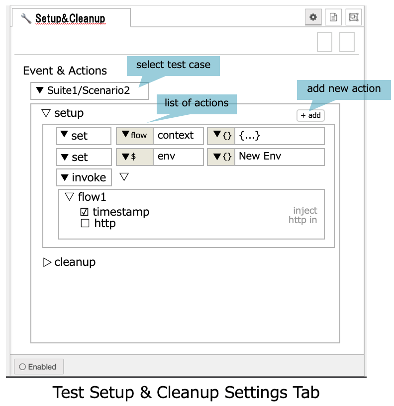

# Flow Testing

## Summary

 This feature allows a flow developer to create test cases for their flows that can be run within the editor or by a CLI tool.

 Within each node, the developer defines a series of test cases.
The test case can describe:

- what message the node should send.
  - if this node is at the start of a flow, this message will be sent when the test case is run.
  - if this is a node in the middle of a flow, the message will be sent when the node receives an incoming message. This will by-pass the internal logic of the node. This allows the node to be stubbed out. It should also be possible to define a message to send when the test case is started - this will allow a test case to begin at any point in the flow
- what message the node expects to receive.
- some way of saying if an error is expected to be reported by the node for a given test case.

## Authors

- Kazuhito Yokoi
- Yuma Matsuura
- Brian Innes
- Nick O'Leary
- Hiroyasu Nishiyama

## Requirements

In traditional programming there are many test frameworks and the functionality needed to property test code is quite well understood (visit [Mocha](https://mochajs.org) to see the typical features offered by a Javascript test framework).  However, the use of test tools in low-code development environments is less well defined, but the need for a thorough testing capability still exists.

This design should deliver the following features/functionality:

- The testing function should be able to be run from within the Node-RED editor or from a command line, so Node-RED application testing can be run as part of an automated delivery pipeline
- The tests should be created using low-code methods, similar to how applications are created using Node-RED.  Ideally creating test cases should not be a coding activity
- There should be the ability to create a "test suite", containing multiple test scenarios rather than a single test
- Test definitions/implementation should not alter a flow in any way that will impact the functionality or performance during normal running
- Test artifacts and configuration should be able to be easily identified and removed from a flow when deploying to a resource constrained device, without impacting the flow.

### Areas for debate/resolution

- Should the testing of a function node have more advanced features, such as testing doubles (stubs and mocks) within the JavaScript code within the node?
  - [H.N.] Regarding the JavaScript code of the Function node, I think it should be treated as a black box by this testing framework.
- How should sub-flow testing be performed?  As node/flow tests in the sub-flow editor or as a node within a main flow?
  - [H.N.] Testing of SUBFLOW in the main flow should be done in the same way as a normal node. 
  - [H.N.] Testing internal logic of SUBFLOW should also be possible from a unit testing perspective.  However, the problem is that there is no mechanism for executing the SUBFLOW template in current runtime.
- How should input node timed/repeat configuration work during test - disabled and let the test explicitly drive all testing or let input node drive testing?
  - [H.N.] This seems to be necessary for all types of nodes, not just input nodes.

### Single Node testing

A single node should be able to be tested in isolation.  Certain nodes, such as the function node or the change node, can contain significant amounts of functionality which may need testing in isolation (similar to unit tests in a traditional programming environment).

- The test specification should permit some setup to occur before testing starts, such as setting environment variable or initialising context objects

- tests should run by sending a specified msg object to the node under test then requiring a set of 'assertions' to be met, such as:
  
  - output exactly matched object(s) defined in the test definition
  - output contained or did not contain a property(s) or property value(s)
  - same as previous 2 bullets, but node generated specified output on a specific output connector (multiple output connections on node)
  - node generated *n* output messages on an output connector
  - node threw an exception
  - [H.N.] Verification of complex result patterns with JSONata or JavaScript.
  - [H.N.] What to do with nodes that are not started by a message?

- [H.N.] Do we allow setting specification of node?
  
  - In the current implementation, it is difficult without knowing the internal implementation of the node.　However, it is useful for various purposes if there is a standard mechanism for setting node configurations with messages or environment variables.

- [H.N.] If we think "Single Node" as a flow consisting of one node, we may be able to use the same framework as the next "Flow testing" provides.

### Flow testing

Rather then testing a single node the flow test will test a flow as a whole.  Here an input node in the flow will be selected as the starting node for a test and a msg object will be specified to originate from the starting node.  This will allow the flow to be tested end to end.

- The test specification should permit some setup to occur before testing starts, such as setting environment variables or initialising context objects
- The test defines the starting node and the message the starting node will output
  - [H.N] It seems that it is necessary to specify multiple message input, its timing, etc in some cases.
- The test can override the configuration properties of any node in the flow for the duration of the test
  - [H.N.] As mentioned above, it seems difficult to overwrite the node settings in the current implementation without knowledge of the internal implementation of target nodes.
  - [H.N.] Do we need to change some of the flow settings for testing?
- The test can specify the same assertions available to the single node test (input message is exactly *{...}* or input message contains property *x* and property *x* has value *y*, ...) for any nodes in the flow, and optionally specify if the node should be run or not. (E.g. a database write node should not actually write to a database, but the test should verify the data arriving at the node would result in the correct database record being created)
- Any node in the flow can be '*stubbed*' to provide canned responses rather than running the node (E.g. a database lookup node can be stubbed to provide a specific response during a test rather than relying on the target database having valid data to match a test scenario)
  - [H.N.] It seems that it is necessary to specify multiple message input, its timing, complex logic, etc.

### Out of scope of this design

This design will not handle any front end testing (dashboards) or Node-RED node development.  The scope of testing is limited to messages passing between nodes in a Node-RED flow at runtime.

- [H.N.] If node testing is out of scope, Single Node Testing may also be out of scope.

## Design

The rest of this document sets out the proposed design of the testing feature.

### High Level Concept

This is an outline of the proposed testing approach within the Node-RED editor.

- A user can define a set of named **test suites** that consist of individual **test cases**

- For each test case, every node can be configured with a desired behaviour. This will be split into three phases:
  
  - **beforeNode** - this phase is triggered when a node receives a message, but *before* the node is given the message. This phase can be used to validate the message arriving.
  
  - **testNode** - this phase, if defined, is used *instead* of the actual runtime node. This allows the node to be stubbed out, for example a node that writes to database or interacts with an external system. In this phase, the test can:
    
    - identify a trigger, either `on-message` or `on-test-start`.
      - [H.N.] If we use the event-based trigger mechanism, can we treat **beforeNode** and **afterNode** in the same way?
    - provide simple 'delay' options (for example, `on-test-start wait 100ms then send {payload:"hi"}`. This would be useful if a flow requires testing the behaviour when multiple messages arrive from one or more nodes in particular orders)
    - send on one or more messages
    - set status
    - log an error
    - ...
    - [H.N.] may need some conditional execution, repetition feature.  probably with JavaScript description for advanced developers.
    - [H.N.] if testNode is defined, the target node is disabled
    
    The UI for who the user defines this behaviour needs to be designed. It could be:
    
    - a simple set of rules like the Switch/Change nodes. (This feels like the right starting point)
    - a Function node approach of writing code (Powerful, but not low-code)
    - use Blockly for a different approach to writing the code (A bit more low-code like, but very different to anything in the core).
    - be a Node-RED flow (I have reservations over how practical this option would be...)
    - [H.N.] simple set of rules for novice users and JS code for advanced users seems appropriate.  
      Also, allowing invocation of nodes in target flow makes writing complex test setup & cleanup easier.  To support this, I'd like to propose adding special kind of tab used for placing a flow.  This tab will be hidden if not test mode and removed on deploy.
  
  - **afterNode** - this phase is triggered whenever the node sends a message, but *before* the next nodes receive it. This phase can be used to validate the message(s) being sent by the node.
  
  - Any phase will be able to fail the test case
  
  - Any phase will be able to mark the test case as having passed.
  
  - Every test case *must* have something that will mark the test case as being passed - otherwise the test case will sit waiting and eventually have to timeout (which would be a fail).
  
  - [H.N.] each test case can have setup and cleanup actions. It will provide:
    
    - [setup] set of initial nodes to be activated,
    
    - setting contexts and environment variables,
    
    - preparing files or other resources,
    
    - [cleanup] catching exceptions,
    
    - ,,,
      
      

With these three phases, a wide range of test scenarios will be possible.

- the `before/afterNode` phases allow for checks at any point in the flow to ensure a message looks right

- the `testNode` phase allows for nodes to be stubbed out with test-scenario specific behaviour

- For flows that expose an API, such as `HTTP In` -> `HTTP Response` flows, there would be two different possible approaches to testing it:
  
  1. the `testNode` phase of the `HTTP In` node to start the test, and the `beforeNode` of the `HTTP Response` node used to verify the result.
  2. an entirely separate Test flow could be created with `Inject` -> `HTTP Request` with the `testNode` of the `Inject` node set to start the test, and the `afterNode` of the `HTTP Request` node used to verify the response.
  
  Both would be valid approaches to writing the test - the main point is this design has the flexibility to support either style.

It must be possible for the user to efficiently disable unrelated nodes entirely on a per-test case basis. For example, if they are testing Flow A, they may not want Flow B attempting to connect to a remote system in the background.

### Running the tests

Running each test case will require starting from a known clean state. For example, if a flow contains a Join node and a test case causes some but not all messages to be passed to it, the node will need to be completely reset before the next test case can start.

The only way to do this is to do a complete stop/start of the flows. This implies the **Test Runner** will need to have access to the **runtime api**. The goal should be for it to be able to operate using the published Runtime API and not use any unpublished APIs (which may drive additional APIs being added to the published set.)

For the `before/after/testNode` phases to be able to intercept messages as they come in and out of nodes, the test runner will need to be in the messaging path. That cannot be done today, but will be possible with the **Pluggable Message Routing** feature.

At a very high level, when the user asks to run some tests, the **Test Runner** will use the **Runtime API** to stop the current flows, then insert the **Test Runner Message Router** into the **Runtime Router Stack**. It will then cycle through all Test Suites and Test Cases, starting the flows, running a test, capturing the result, stopping the flows and then moving onto the next test case.

_Note: At the time of writing, the Pluggable Message Router feature has not been designed. The above description implies a number of requirements on the Message Router design - and they must be taken into account before this feature can make progress._

[H.N.] The runtime provides an API for enable/disable nodes for selectively execute nodes to be tested.

## Flow testing UI on each node property UI

_The following is a proposal for how the general testing concepts will map onto UI features - this needs further refinement before any UI work is started_

To use the flow testing UI, there's a newly wrench button next to the node property button, node description button and node appearance button on the node property UI.
Because each node has test UI inside the node itself, we can avoid spaghetti flows which consist of a lot of nodes and wires for testing.
And obviously, users can easily understand the target node without pointing from other nodes for testing.
Additionally, users can set the default messages in the UI when the node behaves mock node.

 The photo of the idea

 Flow testing UI has the following two `editableList` UI.

- Outputs for test cases
  - Label: Mainly it is for test scenario name. The area has `typedInput` to select String or 'default'. If String is selected, users can input the scenario name in the area. On the other hand, when `default` is selected, the messages specified in the message area will be sent as mock handling.
  - Message: JSON data to send the next node in the flow
- Expected inputs
  - Label: Test scenario name corresponds to the label specified in test cases `editableList`
  - Message: JSON data which will be checked whether the received message equals expected JSON data. The area has `typedInput` to select JSON or JSONata expressions.

In the case of JSONata expression to check expected inputs, the functionality evaluates whether the expression using received messages is true or false.
The following JSONata expressions are examples to check input values.

- Timestamp: `1500000000000 < payload and payload < 3000000000000`
- Specific key, 'age': `'age' in $keys(payload)`
- Array length, 5: `$count(payload) = 5`
- Lower alphabets only: `$exists($match(payload, /^[a-z]+$/))`

When all expected inputs are valid, each node show "success" in the bottom of the node as the status message.
Otherwise, the status has "fail" and an array of scenario names that failed in the test (e.g. "fail: ['test1']").

## [H.N.] Test Events & Actions

Test events are defined for test case and test target nodes. List of actions are defined for defined the test events. 

### Test Events

- Common events - Following events are common to test case and node
  
  - setup: executed at start of the test case,
  
  - success: executed after successful execution of the node,
  
  - fail: executed after failed execution of the test case,
  
  - cleanup: executed at end of the test case,
  
  - timeout: executed after timeout reached for the test case.
  
  - exception: executed after occurrence of exception while executing the node,

- Test case events - No events specific to a test case exists.

- Node events
  
  - setup: executed at start of the test case,
  
  - receive: executed at receive of incoming message by the node,
  
  - stubbed execution: executed after *receive* event instead of message processing of the node,
  
  - send: executed after sending message from the node to output port,

### Test Actions

- Common actions
  
  - invoke - invoke nodes (optionally sending message to target node),
  
  - wait - wait for specified time,
  
  - log - log message,
  
  - function - write complex testing using JavaScript code,
  
  - click - click button of specified node.

- Test case actions
  
  - set - set context or environment variables.

- Node actions
  
  - match - match message property with specified value, expression, or JavaScript code,
  
  - set - set message property or context,
  
  - send - send message to output port,
  
  - catch - catch exception,
  
  - ...

## [H.N.] Tab for Test Flow

In order to support the description of test processing that is difficult to describe in test actions, we allow Node-RED flow to be used for setup and cleanup.  These flows are described in a special tabs for testing.  The tabs for test flow are only displayed and activated in test mode.

These flows are described in a special tab for testing.

## Catching error

 In the test mode, each node internally catches the errors from node.error() and report to the flow testing framework.
For users, they can be aware of the error from the node status or test tab on the sidebar.
If there's a catch node in the flow to catch the error, the node throws an error as same as default behaviors.

## Testing tab in the sidebar

The testing tab is located in the sidebar of the flow editor.

- Test mode button: The button to turn on/off the flow testing mode for flow editor
- Execute button: the button to start test cases
- Scenario tree: The tree view consists of a scenario and nodes which have test cases. The tree view is automatically synchronized with settings on node properties. On the UI, users can see an overview of the settings and status of the test cases.
  [H.N.] In scenario tree, test suites menage multiple test scenarios.

_The left button on the node which is described in the whiteboard is not needed because the first implementation focuses on the sidebar to start flow testing._

[H.N.] Following figure shows an example of proposed test sidebar.  
New test sute and scenario can be added by add button on tree view.

[H.N.] By pressing *setup & cleanup* button of a scenario, following settings panel is displayed.

In this settings panel, user can select test scenario and fill test setup and cleanup actions.

## Flow data

- The test configurations are included in the main flow file. Therefore, there is no need to change the Storage API in the first implementation.
- In case to write thousand test cases, the JSON format of test data should be simple to edit on text editor manually. To manage test cases and separate them from flow JSON data for production, the data will be separated in future implementation.

## Flag to enable flow testing

There are following variety to enable flow testing.

- (1) Flag in an environment variable
- (2) Flag in settings.js
- (3) Switch button on the test tab in the sidebar
- [H.N.] (4) command line option

When (1) or (2) exists before starting Node-RED, Node-RED will run in the test mode.
After starting Node-RED in the test mode, users can turn off/on the mode on the switch button (3).

[H.N.] Or user can enable flow testing by specifying command line option.

## CLI

This flow testing needs to be run on the CLI for targeting to run automatically on Travis CI when receiving a pull request on GitHub.
When running a command like `grunt test-flow`, Node-RED runs flow testing then outputs each result such as the existing Mocha tests.

[H.N.] Node-RED provides command line option for running test suites for CLI testing.
`-t test1,test2,...` runs test suites `test1`, `test2`, ....

## Extending Actions

Flow testing supports addition of test actions using [plugin mechanism]([designs/plugins.md at master · node-red/designs · GitHub](https://github.com/node-red/designs/blob/master/designs/plugins.md)).  It would be useful for adding actions:

- testing files,

- taking screenshot of Node-RED editor,

- testing GUI interactions, 

- ...

## Concerns

- How to test dashboard nodes from flow testing? (it may be impossible)
  → Use plugin support of actions for controlling GUI
- We will add how to run on the CLI. (arguments, example, etc)

## Implementation Note

Look over [here](ImplementationNote.md) for implementation notes.

## History

- 2021-12-08 - Add extension mechanism and implementation note.  Refine events definition.
- 2021-05-28 - Updated proposal
- 2020-07-17 - Add Concepts section
- 2020-06-09 - Add requirements
- 2020-04-13 - Updated proposal
- 2020-01-31 - Initial proposal
