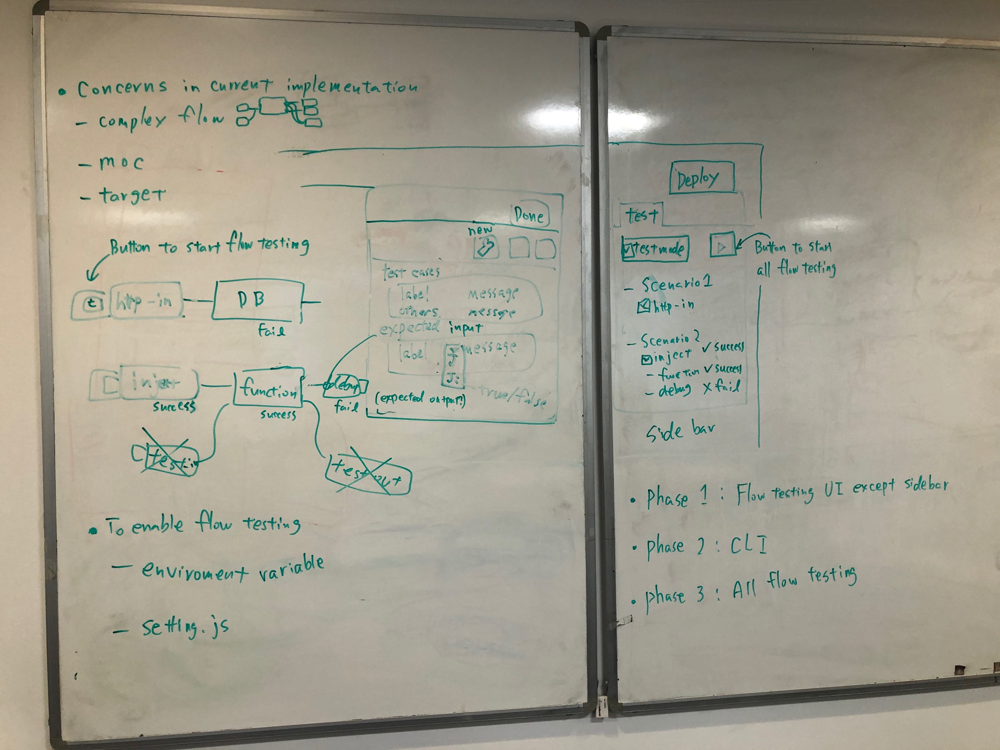

# Flow Testing (another idea)

## Summary
 We found that [the current suggested design note](https://github.com/node-red-hitachi/designs/tree/flow-testing/designs/flow-testing) about flow testing has some concerns as follows.

- Concern 1: Complex flow which has a lot of test-in/out nodes and wires around flow which is tested by the testing framework

- Concern 2: A little confusing to specify and manage the target node from the test-in/out node because the test-in/out node and target node are different.

- Concern 3: Additional mock implementations in nodes are needed as a stub for testing
(For example, DB nodes shouldn't connect to the production database while testing the flow. Therefore, the DB node should behave as stub which receives valid messages and sends imitated messages.)

- Concern 4: How to test and invoke nodes placed in the first of the flow

- Concern 5: How to catch and handle errors from node.error() in nodes
(If a node throws an error in the original idea using test-in/out, the pair of catch node and test-out node may be used to catch the error by flow testing framework. It may also cause too complex flow in which each flow has a pair of nodes.)

 To solve these problems, this document describes another implementation idea. This document is not intended to replace the suggested idea directly. Both ideas can coexist on the flow editor if needed.

## Authors
 - Kazuhito Yokoi
 - Yuma Matuura

## Use Cases (same as the original document)
- Node-RED user does regression testing for the existing flows when updating Node-RED or services that connect with Node-RED.
- Node-RED automatically runs a test on Travis CI when the pull request was posted.

## Flow testing UI on each node property UI
 The flow testing UI on each node property UI will solve concerns 1, 2 and 3. To use the flow testing UI, there's a newly wrench button next to the node property button, node description button and node appearance button on the node property UI. Because each node has test UI inside the node itself, we can avoid spaghetti flows which consist of a lot of test-in/out nodes and wires. And obviously, users can easily understand the target node without pointing from other test-in/out nodes. Additionally, users can set the default messages in the UI when the node behaves mock node.

The photo of the idea

 Flow testing UI has the following two `editableList` UI. The ideas are the same as `editableList` in test-in/out nodes.

 - Test cases
   - Label: Mainly it is for test scenario name. The area has `typedInput` to select String or 'default'. If String is selected, users can input the scenario name in the area. On the other hand, when `default` is selected, the messages specified in the message area will be sent as mock handling.
   - Message: JSON data to send the next node in the flow

 - Expected inputs
   - Label: Test scenario name corresponds to the label specified in test cases `editableList`
   - Message: JSON data which will be checked whether the received message equals expected JSON data. The area has `typedInput` to select JSON or JSONata expressions. In the case of JSONata expression, the functionality evaluates whether the expression using received messages is true or false.

 When all expected inputs are valid, each node show "success" in the bottom of the node as the status message. Otherwise, the status has "fail" and an array of scenario names that failed in the test (e.g. "fail: ['test1']").

## Button to start the flow testing
 To solve the concern 4, each node has the button on the left side like the inject node. In the test mode on the flow editor, all node has the button to invoke itself even if http-in node and mqtt-in node. Because users can execute test cases from the node whose button is clicked, they can create test cases in trial and error style development, the same as that they create flows inserting many inject and debug nodes into the flow.

## Catching error
 In the test mode, each node internally catches the errors from node.error() and report to the flow testing framework. For users, they can be aware of the error from the node status or test tab on the sidebar. If there's a catch node in the flow to catch the error, the node throws an error as same as default behaviors. 

## Testing tab in the sidebar
 The testing tab is located in the sidebar of the flow editor. The tab has almost the same as the original idea of the testing framework. 

 - Test mode button: The button to turn on/off the flow testing mode for flow editor
 - Execute button: the button to start test cases
 - Scenario tree: The tree view consists of a scenario and nodes which have test cases. The tree view is automatically synchronized with settings on node properties. On the UI, users can see an overview of the settings and status of the test cases.

## Flow data
- In case to write thousand test cases, the JSON format of test data should be simple to edit on text editor manually.
- To manage test cases and separate them from flow JSON data for production, the data will be separated in future implementation.

## Flag to enable flow testing
 There're following variety to enable flow testing.

- (1) Flag in an environment variable
- (2) Flag in setttings.js
- (3) Switch button on the test tab in the sidebar

When (1) or (2) exists before starting Node-RED, Node-RED will run in the test mode. After starting Node-RED in the test mode, users can turn off/on the mode on the switch button (3).

## Other concerns
 - How to test dashboard nodes from flow testing? (it may be impossible)
 - We will add how to run on the CLI. (arguments, example, etc)

## History
- 2020-01-31 - Initial proposal
