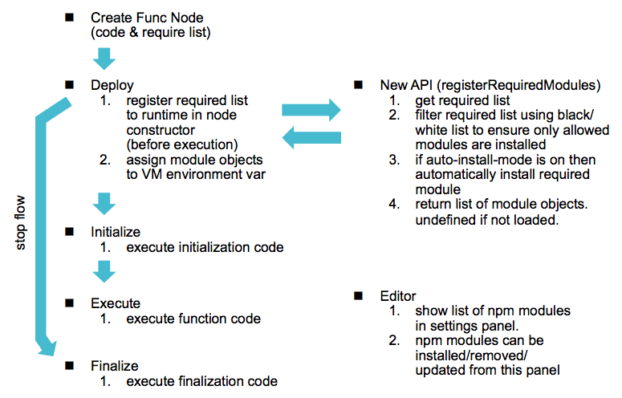
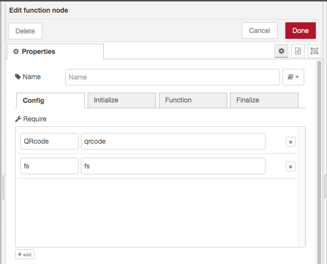
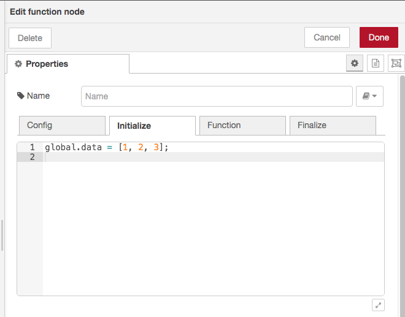

# Lifecycle Model of Function Node

This proposal covers enhanced lifecycle model of function node.

### Authors

 - @HiroyasuNishiyama

### Details

Function node can describe algorithms in JavaScript code.  It plays a central role for expressing complex algorithms by Node-RED flows.  However, current implementation of function node has following problems:

1. Can't use external libraries without modifying settings.js,
2. Function body is executed each time message is received. 
   Describing common initialization or shutdown code is difficult.

This design note addresses these problems.

### Lifecycle Model

Following figure shows new lifecycle model of function node.  While creating a flow using function node, a user  can specify following items in settings panel:

- required npm modules

  module to be loaded and variable name for accessing loaded module object,

- initialization code
  code fragment executed at startup of the flow,

- function body code
  code fragment exected when a message is received (same one in current function node),

- finalization code
  code fragment executed when the flow is stopped.



### Use of External JavaScript Libraries

If required modules are not installed, we need a means to install NPM modules from inside Node-RED editor.  This requires considerations on security, restriction of environments, user interaction, and other topics.  In the above lifecycle model, we propose to make automatic (e.g. for headless Node-RED) or interactive module installation selectable by changing a value in `settings.js`.  

Function node declares its required NPM module list in its settings panel.   For interactive mode, users can install, uninstall, or update NPM module from this settings panel.



A user can use required NPM module through a variable defined in this setting panel.

For example, with above setting, `fs` variable in function node code can access `fs-ext` module without `require` call.

If a user specifies different versions of NPM module, version conflicts may occur.  The Node-RED runtime provides APIs for installing different versions.  Using this APIs, NPM modules can be installed locally to each function node.

If Projects feature is enabled, the Node-RED runtime updates project's `package.json` on deploy if specified in `settings.js`.

#### Additional settings for external npm module in `settings.js`

Add a top-level property named `externalModule` to `settings.js`.  It points to a object with following properties.

| name | type   | required | description  |
| :--- | :----- | :------- | :----------- |
| mode | string | yes      | one of `"auto"`, `"auto-update"`, `"manual"`, or `"none"` (default: `"manual"`)<br/>- `auto`: automatically install requested NPM module if not installed.<br/>- `auto-update`: same as `auto` but with automatic update if newer version is available.<br/>- `manual`: users can manually install requested NPM module from user settings panel.<br/>- `none`: installation of external NPM modules is not allowd |
| allowList | array of string | no | List of regular expressions that matches module's NPM registry specification. External libraries that matches this list **can** be used in `Function` nodes. |
| denyList | array of string | no | List of regular expressions that matches module's NPM registry specification. External libraries that matches this list **can not** be used in `Function` nodes. |

`allowList` precedes over `denyList`.

```
    // Example of settings.js
    externalModules: {
        mode: "manual",
        allowList: [
            "^fs-ext$",       // allow fs-ext
            "^qrcode@1.4.4$"  // allow qrcode version 1.4.4
        ],
        denyList: [
            ".*"              // disallow others 
        ]
    },
```
If the `externalModule` property not exists, `none` mode and denyList of `".*"`, meaning not allow installation and use of external module, is expected as a default.

#### New API for installing NPM module

In order to allow NPM modules to be installed automatically before node execution, `RED.nodes.registerType` will be extended to accept new `dynamicModuleList` property in an optional third parameter.  It may have following value:

1.  a `string` value that represents a property name of a node instance.  The property of the node instance must have a list of modules to install.

   ```
   // Node definition
   RED.nodes.registerType("function", FunctionNode, {
       dynamicModuleList: "modules"
   });
   ```

   ```
   // Node instance definition
   {
       ...
       "modules": [ "fs-ext@1.2.3", "qrcode@1.4.4" ]
       ...
   }
   ```

2. or an array of Objects that must have a `name` property and may have a `scope` propety (but can have any other properties)

   ```
   // Node definition
   RED.nodes.registerType("function", FunctionNode, {
       dynamicModuleList: "modules"
   });
   ```

   ```
   // Node instance definition
   {
       ...
       "modules": [ 
           { 
               "name": "fs-ext@1.2.3", 
               "scope": "function:xyz",
               "var": "fs", 
               ... 
           },
           { 
               "name": "qrcode@1.4.4", 
               "scope": "function:xyz",
               "var": "qrcode", 
               ... 
           }
       ],
       ...
   }
   ```

   The Node-RED runtime will scan the list of modules to install in nodes deploy process before starting nodes execution.  A module in the list will be installed, if auto mode is specified in `settings.js` .  If `scope` is specified, NPM module is installed locally to specified scope.  On removal of a node with locally installed NPM modules, the node must uninstall the installed modules.

   In order to support installation of NPM modules, the Node-RED runtime provides following  API:

   - `RED.require(module, opt)`

     `RED.require` function is extended to accept second parameter.  If the second parameter is provided, *module* parameter represents NPM module specification.  And *opt* must be an object that must have `type` property.  The `type` property  have one of `stat`/`install`/`uninstall`/`update`.

     In order to allow different versions of NPM module can be used by different nodes, the modules can be made local to specified scope. 

     For each `type` value, `opt` object have following additional properties and `RED.require` returns a Promise that resolves to following result values:

     - `stat`: get status of NPM module

       - `opt` object:

         | name | type   | required | description         |
         | ---- | ------ | -------- | ------------------- |
         | `id` | string | no       | ID of target module |

       - result: information of NPM module

         | name  | type   | description                                  |
         | ----- | ------ | -------------------------------------------- |
         | scope | string | ID of the module, otherwise `null`           |
         | name  | object | object containing module version information |

         `name` property points to an object with following properties:

         | name      | type   | description                                               |
         | --------- | ------ | --------------------------------------------------------- |
         | installed | string | version string if installed, otherwise `null`             |
         | current   | string | version string if latest version exists, otherwise `null` |

     - `list`: list installed NPM module

       - `opt` object: 

         | name  | type   | description     |
         | ----- | ------ | --------------- |
         | scope | string | scope of module |

       - result: array of objects with following properties that represents installed module information 

         | name | type   | description      |
         | ---- | ------ | ---------------- |
         | id   | string | ID of the module |
         | name | object | version string   |

     - `install`: install NPM module 

       - `opt` object:

         | name          | type   | required | description                                     |
         | ------------- | ------ | -------- | ----------------------------------------------- |
         | scope         | string | no       | make installed module local to specified scope. |
         | updatePackage | bool   | no       | update `package.json` for Projects              |

       - result: installed object information

         | name   | type   | description             |
         | ------ | ------ | ----------------------- |
         | id     | string | ID of installed object  |
         | module | object | installed module object |

     - `uninstall`

       - `opt` object:

         | name | type   | required | description         |
         | ---- | ------ | -------- | ------------------- |
         | id   | string | no       | ID of target module |

       - result: none

     - `update`

       - `opt` object

         | name | type   | required | description         |
         | ---- | ------ | -------- | ------------------- |
         | id   | string | no       | ID of target module |

       - result: updated object information

         | name   | type   | description           |
         | ------ | ------ | --------------------- |
         | id     | string | ID of updated object  |
         | module | object | updated module object |

### Initialization and Finalization

Add new tabs (`Initialize`/`Finalize` [tab names must be reconsidered]) for specifying code for common initialization or shouttown code.  Code executed for each received messages (same as code in current Function node) can be specified in `Function` tab.  This `Function` tab is selected by default.



Button for expanding code editor should be moved to bottom of settings panel in order to make editing area larger.

#### Available APIs for initialization/finalization code

The `node` variable can not be accessed from initialization/finalization code.  Therefore, it is not possible to use APIs depending on `node` such as `node.send`.  Contex APIs for `flow` or `global` context can also be used.

#### Asynchronous processing

If the initialization code needs to start an asynchronous work that needs to be resolved before the start of the function body, it is possible to return the promise from initialization code.  Initialization code is wrapped by async function, thus can use `await` withing the code.

During the initialization process, other nodes may become active and may send messages to the function node. In such a case, the accepted messages are stored until the initialization process is completed, and they are processed in the order in which they were received when the initialization process is completed.

#### Error handling 

Exceptions to the initialization code are logged to console. If error handling is necessary, it should be handled in the initialization/termination code appropriately.

### Library Enhancements

Export format of function node to Node-RED library currently uses comments to encode properties.  This must be extended to be able to include initialization/finilization code and required npm modules information.

### Additional Properties to Function node

In order to support NPM module installation and initialization/finalization code, following properties are added the Function node.

| ame          | Type            | Description                        |
| ------------ | --------------- | ---------------------------------- |
| `initialize` | `string`        | JavaScript code for initialization |
| `finalize`   | `string`        | JavaScript code for finalization   |
| `modules`    | array of object | Array of NPM module specifications |

- `initialize`/`finalize` property

  String representation of JavaScript code executed on initialization/finalization of function node.

- `modules` property

  Specify NPM modules that should be installed before execution of `Function` node. It is an array of objects containing following properties:

  | Name   | Type     | Description               |
  | ------ | -------- | ------------------------- |
  | `spec` | `string` | NPM install specification |
  | `var`  | `string` | JavaScript variable name  |
  
  `spec` specifies module specification (e.g. "fs-extra@1.2.3").  `var` defines variable name that can be used to access module object in `Function` node code.  


## History

  - 2020-02-09 - Initial Note
  - 2020-04-02 - Update API access and error handling in init/final code
  - 2020-04-10 - Update async processing in initialization code
  - 2020-04-16 - Update message handling received while async initialization
  - 2020-06-01 - Update NPM installation details
  - 2020-07-23 - Update NPM installation details
  - 2020-07-25 - More update on details of NPM installation