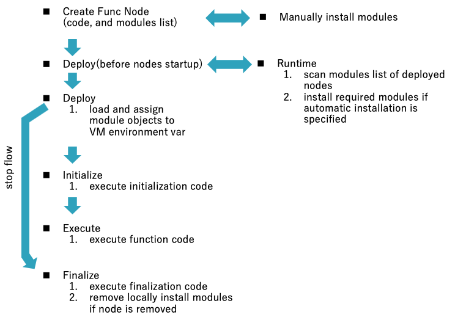

# Lifecycle Model of Function Node

This proposal covers enhanced lifecycle model of function node.

### Authors

 - @HiroyasuNishiyama

### Details

Function node can describe algorithms in JavaScript code.  It plays a central role for expressing complex algorithms by Node-RED flows.  However, current implementation of function node has following problems:

1. Can't use external libraries without modifying settings.js,
2. Function body is executed each time message is received. 
   Describing common initialization or shutdown code is difficult.

This design note addresses these problems.

### Lifecycle Model

Following figure shows new lifecycle model of function node.  While creating a flow using function node, a user  can specify following items in settings panel:

- required npm modules

  module to be loaded and variable name for accessing loaded module object,

- initialization code
  code fragment executed at startup of the flow,

- function body code
  code fragment exected when a message is received (same one in current function node),

- finalization code
  code fragment executed when the flow is stopped.

### Use of External JavaScript Libraries

New config tab includes declaration of list of JavaScript variable and required module.

If required modules are not installed, we need a means to install NPM modules from inside Node-RED editor.  This requires considerations on security, restriction of environments, user interaction, and other topics.  In the above lifecycle model, we propose to make automatic (e.g. for headless Node-RED) or interactive module installation selectable by changing a value in `settings.js`.  

Function node declares its required NPM module list to runtime by using new API.   For interactive mode, we add NPM management UI in editor settings panel.

Because current Node-RED implementation starts flow execution before message handler callback is ready, we may need to modify runtime execution model in order to make function nodes wait for receiving messages before required NPM modules become ready to use.

### Initialization and Finalization

Add new tabs (`Initialize`/`Finalize` [tab names must be reconsidered]) for specifying code for common initialization or shouttown code.  Code executed for each received messages (same as code in current Function node) can be specified in `Function` tab.  This `Function` tab is selected by default.

Button for expanding code editor should be moved to bottom of settings panel in order to make editing area larger.

#### Available APIs for initialization/finalization code

The `node` variable can not be accessed from initialization/finalization code.  Therefore, it is not possible to use APIs depending on `node` such as `node.send`.  Contex APIs for `flow` or `global` context can also be used.

#### Asynchronous processing

If the initialization code needs to start an asynchronous work that needs to be resolved before the start of the function body, it is possible to return the promise from initialization code.  Initialization code is wrapped by async function, thus can use `await` withing the code.

During the initialization process, other nodes may become active and may send messages to the function node. In such a case, the accepted messages are stored until the initialization process is completed, and they are processed in the order in which they were received when the initialization process is completed.

#### Error handling 

Exceptions to the initialization code are logged to console. If error handling is necessary, it should be handled in the initialization/termination code appropriately.

### Library Enhancements

Export format of function node to Node-RED library currently uses comments to encode properties.  This must be extended to be able to include initialization/finilization code and required npm modules information.

## History

  - 2020-02-09 - Initial Note
  - 2020-04-02 - Update API access and error handling in init/final code
  - 2020-04-10 - Update async processing in initialization code
  - 2020-04-16 - Update message handling received while async initialization