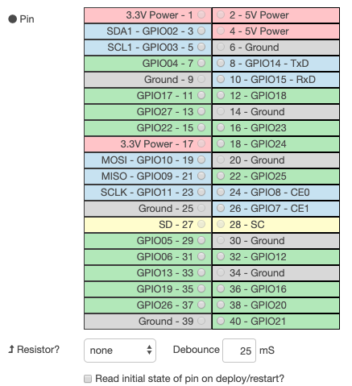

# Enhanced GPIO Node

This proposal covers enhancement to the GPIO node (`node-red-node-pi-gpio`).  

The GPIO node provide an easy way to control hardware using Node-RED.
However, there are some cases where it is difficult to control certain types of hardware using current GPIO node.
Therefore, this proposal aims to extend the GPIO node to meet such requirements.

### Authors

 - @HiroyasuNishiyama

### Details

#### Current Implementation of GPIO Node

The current GPIO node can define input and output to a single GPIO pin using the following setttings interface.



The GPIO node internally uses the **RPi.GPIO** python module to control a hardware.  

When GPIO is used to control a hardware, in some cases, the following features are required:

1. simultaneous signal output to multiple pins,
2. sequencing of signal outputs to multiple pins,
3. specifying the delay between signal outputs,
4. abstraction of processing including GPIO input and output using subflow.

With the underlying RPi.GPIO module, item 1 can be realized by specifying the output pins as an array. 

Item 2 and 3 can be realized by combining complete and delay nodes, but it becomes difficult to understand the dependency between GPIO node and complete node, and the flow becomes complicated. 

Item 4 needs some way to pass GPIO control information from environment variable.

### Proposal of Enhancements to GPIO Node

In order to solve the above problems, we propose the following extensions to GPIO nodes.  

#### GPIO in node

1. Add advanced mode checkbox. 
2. In advanced mode, the **GPIO in** node has input port and can receive a payload value:

  a. JavaScript object containing following properties:
  
  | Name    | Type    | required    | Desc.                    |
  |:--------|:--------|:------------|:-------------------------|
  | `pin`   | int     | +           | GPIO pin number          |
  | `delay` | number  | -           | delay after input in ms  |
  | `wait`  | number  | -           | wait befor input in ms   |

  These property values are uses to specify input pins and related delay values.  Output payload value is `0`/`1`.
  
  - Example: input from pin#11 then wait for 100ms

  ```[javascript]
  {
      pin: 11,
      delay: 100
  }
  ```

  b. `pin` of (a) can be array of GPIO pin numbers.  In this case, an object that contains pin number as a key and corresponding GPIO input value as its value is sent as payload value.

  - Example: input from pin#11 and pin#12 then wait for 100ms

  ```[javascript]
  {
      pin: [11, 12],
      delay: 100
  }
  ```
  
  - Example of output message payload

  ```[javascript]
  {
    '11': 1,
    '12': 0
  }
  ```
  
  c. array of object of (a) ~ (b).  In this case, the objects in the array are applied sequentially.  Output message is same as (b).

  - Example: input from pin#11, wait for 100ms, then input from pin#12

  ```[javascript]
  [
      {
          pin: 11,
          delay: 100
      },
      {
          pin: 12
      }
  ]
  ```

  d. JavaScript object containing following properties:

  | Name       | Type   | required  | Desc.                |
  |:-----------|:-------|:----------|:---------------------|
  | `pin`      | int    | +         | GPIO pin number      |
  | `setup`    | string | +         | pullup/pulldown/none |
  | `debounce` | number | -         | debounce time in ms  |

  In this case, input payload property values are used to setup a corresponding GPIO pin.  Output payload value is `true`.

  - Example: setup pin#11 for pullup and 25ms debounce time
  
  ```[javascript]
  {
      pin: 11,
      setup: "pullup",
      debounce: 25
  }
  ```  
  
#### GPIO out node

1. Add advanced mode checkbox. 
2. In advanced mode, the following values can be received as a payload value instead of simple integer value:

  a. JavaScript object containing following properties:
  
  | Name    | Type  | required  | Desc.                    |
  |:--------|:------|:----------|:-------------------------|
  | `pin`   | int   | +         | GPIO pin number          |
  | `value` | number| -         | value to output          |
  | `delay` | number| -         | delay after output in ms |
  | `wait`  | number| -         | wait befor output in ms  |

   These property values are used to output values to GPIO pins.
  
  - Example: output `1` to pin#11 then wait for 100ms

  ```[javascript]
  {
      pin: 11,
      value: 1
      delay: 100
  }
  ```

  b. `pin` of (a) can be array of GPIO pin numbers.  In this case, value specified by `value` is outputted to specified GPIO pins.
  
  - Example: output `1` to pin#11 and pin#12 then wait for 100ms

  ```[javascript]
  {
      pin: [11, 12]
      value: 1
      delay: 100
  }
  ```

  c. `pin` and  `value` of (a) can be arrays of same length.  In this case,  a value in `value` array is outputted to corresponding pin in `pin` array.
  
  - Example: output `1` to pin#11 and `0` to pin#12 then wait for 100ms

  ```[javascript]
  {
      pin: [11, 12]
      value: [1, 0]
      delay: 100
  }
  ```

  d. `pin` of (a) can point to a object that contains pin number as a key and corresponding GPIO input value as its value is sent as payload value.
  
  - Example: output `1` to pin#11 and `0` to pin#12 then wait for 100ms

  ```[javascript]
  {
      pin: {
        '11': 1,
        '12': 0
      },
      delay: 100
  }
  ```
  
  d. array of object of (a) ~ (c).  In this case, the objects in the array are applied sequentially.

  - Example: output `1` to pin#11, wait for 100ms, then output `0` to pin#12

  ```[javascript]
  [
      {
          pin: 11,
          value: 1,
          delay: 100
      },
      {
          pin: 12,
          value: 0
      }
  ]
  ```
  
  e. JavaScript object containing following properties:

  | Name       | Type  | required  | Desc.           |
  |:-----------|:------|:----------|:----------------|
  | `pin`      | int   | +         | GPIO pin number |
  | `mode`     | string| +         | pmw/digital     |
  | `frequency`| number| -         | for PWM mode    |
  
  These properties are used to setup mode of a GPIO output pin.
  In PWM mode, output value of GPIO pin can be floating point or `null`/`undefined`.  If the values is `null`/`undefined`, PWM for specified GPIO pin is stopped.

  - Example: setup pin#11 for PWM mode for 5hz
  
  ```[javascript]
  {
      pin: 11,
      mode: "pwm",
      frequency: 5
  }
  ```  
  
3. In advanced mode, **GPIO out** node has an output port.  The **GPIO out** node outputs a message containing payload with `true` value.

## History

  - 2020-05-16 - initial draft proposal