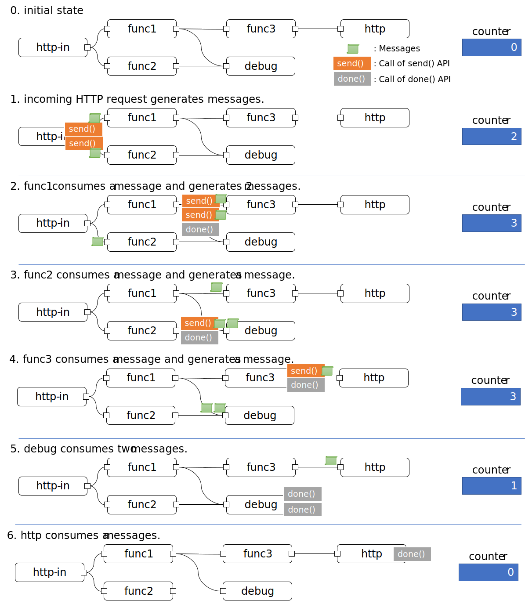
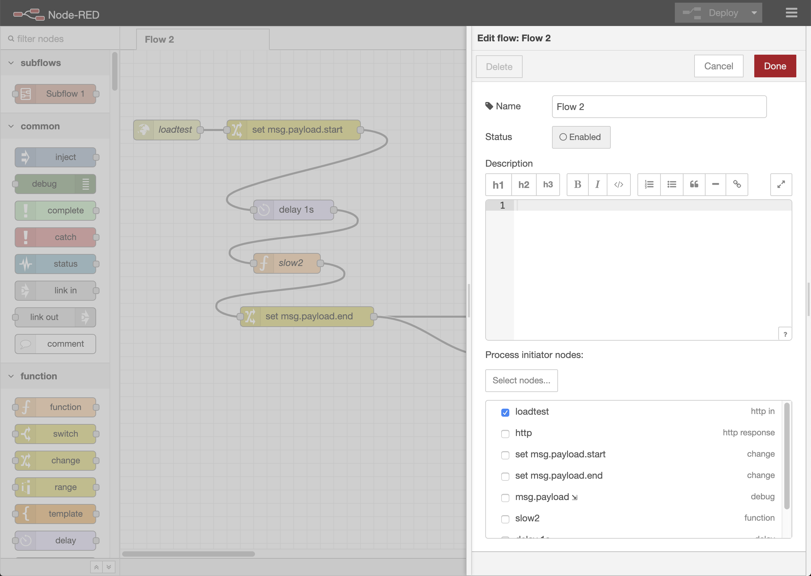

# Graceful Shutdown

## Summary

Introduce a graceful period in Node-RED shutdown process to prevent
interrupting in-progress processes. 

## Authors

 - @k-toumura

## Details

### Introduction

When Node-RED runtime shutdowns itself, all active nodes are simultaneously
closed by the runtime.  Therefore, even if there are in-progress processes in the flow,
these processes are forcibly interrupted.
This design note describes a graceful shutdown function that
temporarily suspend the shutdown process until the in-progress processes are completed.

To implement a graceful shutdown, following two functions are needed.

- stop nodes which initiate new processing, for example:
  - inject node: initiate new processing by injecting messages periodically.
  - I/O category nodes: incoming message triggers a new processing.
  - others: create infinite loop with delay node, or custom node which generate new message.
- waiting in-progress messages to complete
  - confirm that all nodes are completed and no in-progress messages is existed.
 
Note that shutdown processes of each node can be described in
definition of `close` event handler.
In this design note, we deal with graceful shutdown process of
entire flows.

### Considerations in preventing tp generate new process

By sending `close` event to nodes, we can stop generate new message by
the nodes.  For example, inject node removes callbacks created by `setInterval()` in `close` event handler.  Also, I/O category node such as http-in nodes stop accepting new request by remove incoming message handler and avoid further message processing.

But, it is difficult for Node-RED runtime to infer which node is generate newer message.  And also, developer can generates newer process by creating infinite loop.

For this reason, we use a flow configuration tab so that
flow developer can indicate which nodes should be closed to
prevent generating new process. 

### Considerations in detecting in-progress processing

After stopping nodes which generate new process, Node-RED should 
determine whether all in-progress process is completed.

#### Current approach:

Assuming that all implementations of node use [Node Messaging API](../node-messaging-api.md), we can use send() and done() callback
for counting in-progress messages.

- When `send()` is called, the runtime add a number of messages sent to an in-progress message counter.
- If a node generates message(s) voluntarily (i.e. other than `node.on("input")` handler),
    the node also increments the counter.
- When `done()` is called, the runtime decrements the counter. 
  - Note that the `done()` is called only from `input` event handler, not called in voluntary message generating process. 

To shutdown gracefully:
- Firstly, the runtime stops message generating nodes.
- Then, the runtime waits for the counter to be zero, or for the graceful period to be expired.
- After that, the runtime shutdown all the nodes.




### User Experience and mock-up UI designs

#### Flow developers

In configuration panel of each flow, flow developers configure
which node should be closed at the initial phase of graceful shutdown.  These node are called *process initiator nodes*.



#### Flow users

Graceful shutdown function is disabled if you doesn't enable it explicitly on the `$HOME/settings.js`.

To use Graceful shutdown function, users should add following settings to enable graceful shutdown, and a duration of the graceful period.
```
  gracefulShutdown: true,
  gracefulPeriod: 10000 # milliseconds
```

Current implementation depends on the use of Node Messaging API.
If all of following conditions are true, the runtime can't detect in-progress processes:
- graceful shutdown is enabled in `settings.js`.
- one or more process initiator nodes are checked in configuration panel of each flow
- the flow contains nodes which doesn't use Node Messaging API, the runtime 

In this situation, users may experience following gliches:
- The runtime wait a full graceful period, in spite of no in-progress processes.
- The runtime prematurely shutdown, in spite of existing in-progress processes.


## Related Design Notes
- [Node Messaging API](../node-messaging-api.md)
- [Node Timeout API](../timeout-api.md)

## History

- 2019-09-24 - Initial proposal submitted

