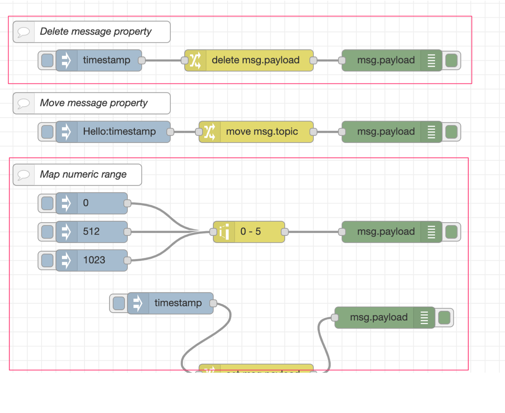
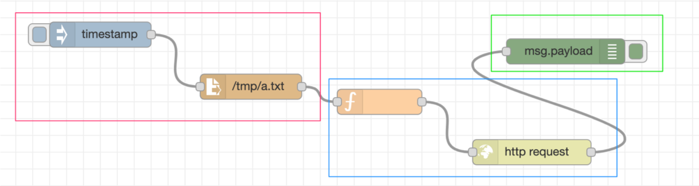

# Grouping Nodes

## Summary

This design note covers the ability to group nodes in the editor in a way that
is familiar to many drawing applications such as PowerPoint.

A group of nodes can be moved, copy/pasted as a single entity within the editor.

The group can have some visual properties applied, including a border width/color/
style and a background color/style.

The group can also have additional key/value pairs applied to it. These properties
are then available to the nodes within the group.

## Authors

 - Nick O'Leary

## Use Cases

### Documenting Flows

The visual appearance of the group can be used to help document the flows directly
in the workspace.

We already provide multiple ways to document flows - adding descriptions to flows
and nodes, and adding Comment nodes to the workspace. But none of these approaches
help to indicate what nodes a Comment node is related to.

By creating a group with a Comment node in the corner as a label, it is clearer
what the Comment node relates to.



### Adding metadata to parts of the flow

There is a long-term concept for Node-RED where a flow as drawn in the editor
is actually deployed across multiple runtimes.

By using groups, and then applying suitable metadata to each group, the runtime
would then be able to take appropriate action to deploy the different parts to the
require location.



### User-defined scalability of flows

Related to the previous use case, the metadata provided by a group could be used
by the runtime to scale different parts of the flow in different ways. The user
would be able to identify which parts of the flow is suitable for scaling and
which should not be scaled.


## Details

This design needs to cover:

 - The definition of a group
   - How is a group represented in the flow file?
   - Can a group contain groups? (hierarchy of groups)
   - Can a node exist in more than one group? (overlapping groups)
   - What properties does a group have?
 - The user interaction with groups in the editor:
   - How does a user create a group?
   - How are a group’s properties edited?

### Definition of a group

A group is defined as:

```
{
    "id": 123,
    "type": "group",
    "z": "container-id",
    "nodes": [ list of node/group ids]
    ...other metadata...
}
```
#### Group properties

 - **id** - unique identifier for the group
 - **type** - ``"group"``
 - **name** - a user-friendly name for the group
 - **z** - identify the container of the group. This will be the id of the `tab`
   or `subflow` it is in.
 - **g** - if the group is nested inside another group, this will be the id of
   the parent group.
 - **nodes** - an array of node/group ids that are in the group.
 - **style** - an object containing properties related to the appearance of the group.
   These will be roughly consistent with SVG/CSS styles. The exact list of properties
   may change.
    - **stroke**
    - **stroke-opacity**
    - **fill**
    - **fill-opacity**
    - **label** - `boolean` - whether to display the name as a label
    - **label-position** - `string` - where to place the label. This is expressed
      as compass positions: `nw`,`n`,`ne`,`sw`,`s`,`se`.
    - **color** - `string` - label text color

 - **meta** - (name tbd) - an object of user-defined metadata for the group


### Flow file representation

Groups are added to the flow as a new `group` node type.

For backwards compatibility, `node-red-node-group` has been published that can
be installed in older versions of NR to provide a `group` node type. This just
allows the flow to run - it does not add any group functionality.


When a node is added to a group, it gains a `g` property that identifies the id
of the group it is in.

### User Interaction

This is the most important part to get right and not all of it can be designed
on paper. Some of the fine detail will come from experimentation.

The intention is the grouping function is familiar to users who have used grouping
functions in other applications, for example, PowerPoint, Keynote and Inkscape.

More research and testing of those applications is needed to identify the standard
patterns of interaction with groups and their contents. They are all slightly
different, so we need to identify what feels right in the Node-RED context.

#### Creating a group

1. The user selects one or more nodes in the workspace
2. They then create the group by either:
   - Invoke the new `core:group-selection` action
   - Use the keyboard shortcut assigned to that action
   - Select the `Create Group` option from the drop-down menu

#### Ungrouping

1. The user selects a group in the workspace
2. They then remove the group by either:
   - Invoke the new `core:ungroup-selection` action
   - Use the keyboard shortcut assigned to that action
   - Select the `Remove Group` option from the drop-down menu

This will remove the group but leave its contents in place.

#### Deleting a group

1. The user selects the group.
2. They delete it by pressing the delete key
   - Invoke the existing `delete-section` action
   - Use the keyboard shortcut assigned to that action

#### Editing a group

1. The user double-clicks on the group to open its edit dialog
2. The edit dialog provides options to set its appearance:
   - border color, thickness and style
   - background color, opacity and style
   - size and padding

As with nodes, it will have a Description tab in the edit dialog.

It will also provide a properties table where user-defined key/value pairs can
be set. (This could be done in a later iteration - it isn't required for the
initial implementation)


#### Adding a node to an existing group

We don't want the groups to get in the way of creating flows. Once a group has
been created, it should be easy to add/remote nodes from the group without having
to ungroup, select the nodes, recreate group.

##### Dragging a node into a group

If the node is dragged over a group, and the user pauses the drag for a couple of
seconds, it will 'enter' the group. This will reduce the chance of a node being
accidentally added to a group when moving them around.

##### Merging selection

Another action will be provided called `core:merge-selection-to-group`. This
will merge the current selection into a group.

If all of the selected 'things' are nodes, this is equivalent to the `core:group-selection`
option.

If there are one or more groups in the selection, they will be merged to be a single
group. The new group will adopt the appearance of the first group in the selection.
This is different to the `core:group-selection` action which would create a new group
containing the groups.

#### Removing a node from a group

There's not an obvious way to drag a node out of a group. Maybe adding a combined
keyboard meta-key + mouse option (We already use `Shift-Drag` to toggle `snap-to-grid`
whilst dragging). Not sure how intuitive that would be.

As of 1.1.0, no such mouse action has been implement for removing a node from a group.

An action will be provide called `core:remove-selection-from-group` that
can be used to move the selection out of the group, with a keyboard shortcut
and menu item.


## History

- 2020-07-09 - Updated to reflect what shipped in 1.1.0
- 2020-01-15 - Initial proposal
