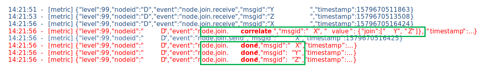

# Message Tracing by metric log 

## Summary

To enable precise tracing of each message, we propose to make the runtime emit
log message whenever the message processing is finished.   For more complex
tracing for nodes which splitting or joining the messages, these nodes may
emit a *correlation* log to provide information of
which message is depend on another message.

## Authors

 - @k-toumura

## Details

### Use case

In debugging, we want to trace the messages. Currently, we use Debug nodes to confirm that a process in some node is finished. But:

- we can't know whether the message is received and start processing in some node.
- inserting Debug nodes is cumbersome process, and readability become worse.

By enabling metric log, we can see message IDs that is sent/received.
But, if the node doesn't send a message, we can't confirm that
the processing in the node is finished.

Moreover, if the node send a message asynchronously, it is difficult
to analyze a causal relationship between messages.

For example, there is a flow configured like following diagram:

and the runtime emittted the following metric logs.


Node "D" receives message "X", run join process, and then emit message to node "E",
but, we can't confirm that messages "Y" and "Z" been processed, or still queued in node "D".

### Requirement

To trace a message, we should know:
- when the processing of the message is finished.
- which messages are related to the message. 

### Proposed changes

#### Metric log for message process completion in a node

Emit metric log when nodes calls `done()` callback, such like:
```
26 Feb 09:33:26 - [metric] {"level":99,"nodeid":"8b1f2328.8e972","event":"node.join.done","msgid":"2522bce.e667944","timestamp":1582677206863}

```
where:
 - nodeid: id of a node
 - event: `node.NODETYPE.done`
 - msgid: id of a message that the node has finished processing
 - timestamp: Unix time in millisecond

#### Metric log to correlate between messages

Emit metric log when sent a message which is related to other messages using:
```
node.metric("correlate", msg, {relationType: relatedMsgIds})
```
where:
- msg: message in process.  For example, when join node send a concatenated message, use the message as an argument of `node.metric()`.
- relationType: a relation type, such as `join`, `splitInto`, `isDependsOn`, etc.
- relatedMsgIds: array of ids of related messages.

For example, in Join node, the metric is emitted at end of each completion of message joining process:
```
var completeSend = function(partId) {
    ...
    // (assume the module maintains message Ids of combined messages in group.combinedMsgInfo[].id)
    node.send(RED.util.cloneMessage(group.msg));
    node.metric("correlate", group.msg, {join: group.combinedMsgInfo.map(e=>e.id)});
}
``` 
(from https://github.com/node-red/node-red/blob/master/packages/node_modules/%40node-red/nodes/core/sequence/17-split.js#L483).

### Usage example

For the example shown in Use cases, the proposed metric logging makes message traceable.  



- by `node.join.correlate` event, we can assume that message X is joined with message Y and Z.
- by `node.join.done` event, we can assume that processing of message X, Y and Z are completed.

## Related topics

- [Metrics Usage design note](../metrics-usage.md)
- [Graceful Shutdown design note](../gracerul-shutdown/README.md)
- [Pluggable Message Routing](../pluggable-message-routing.md)

## History

- 2020-07-14 - Initial proposal submitted

