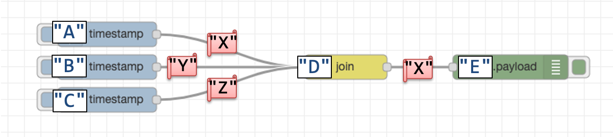

# metrics usage

## Summary

Metrics logs are useful for gathering and estimating execution statistics of Node-RED.  This design note summarizes metrics usage scenarios and expected enhancements on them.


## Authors

 - @HiroyasuNishiyama
 - @k-toumura

## Details

### Supported Metrics Logs

Currently, Node-RED runtime and its core nodes support following metrics logs.

|      | Runtim/Node         | Name                                                   |
| ---- | ------------------- | ------------------------------------------------------ |
| 1    | Runtime (all nodes) | `send`, `receive`                                      |
| 2    | `Function` node     | `duration`                                             |
| 3    | `Httprequest` node  | `duration.millis`, `size.bytes`                        |
| 4    | `Http in` node      | `response.time.millis`, `response.content-length.size` |

### Usage Scenarios and Enhancements

Following table lists possible usage scenarios and enhancements of metrics logs:

|      | Purpose                                       | Used Metrics                                                 | Metrics Usage                                                | Desc.                                                        |
| ---- | --------------------------------------------- | ------------------------------------------------------------ | ------------------------------------------------------------ | ------------------------------------------------------------ |
| 1    | Capture Elapsed Time                          | `send`, `receive`                                            | *<elapsed time>*=*<time of recv>*-*<time of send>*           | \- current implementation (1.0-) can not be used for this purpose because of async message send [(Issue #2444)](https://github.com/node-red/node-red/issues/2444) <br />- processing between `recv` and `send` must be synchronous or new metrics that logs transfer of control is required |
| 2    | Trace Message Processing                      | *send*, *receive*, **done**                                  | use message ID to create directed graph to capture execution path | - current implementation do not record end of message processing ([Issue #2446])[https://github.com/node-red/node-red/issues/2446],<br />\- `send` and *done* must contain ID of contributing input messages |
| 3    | Statistics on Incoming/Outgoing  HTTP request | - `duration.millis`, `size.bytes`<br />- `response.time.millis`, `response.content-length.size` | use metrics logs to know statistics on HTTP requests         |                                                              |
| 4    | Processing time of `Function` node            | `duration`                                                   | use metrics log to know processing time of `Function` node   | - similar problem to #1 can occur if function body is not synchronous. |

### Node coding conventions

#### for '1. Capture Elapsed Time'

To measure an elapsed time for asynchronous operation, each node should emit following logs:
1. When the node receives a message and then put further operation for the message to asynchronous function.
2. When the asynchronous operation is started or completed.
```
node.on("input", function(msg, send, done) {
    // handle a message, but not complete its processing.
    // e.g. put it on a queue, or schedule timeout function.
    setTimeout(function(msg, send, done) {
        // start asynchronous operation
        node.metric("asyncStart");      // 2.
        send(msg);
        done();
        node.metric("asyncEnd");        // 2.
    }, 100000);
    node.metric("receiveEnd");          // 1.
```

#### for '2. Trace Message Processing'

When a node creates message(s) which is related to received message (e.g. split node),
or the node aggregate multiple messages (e.g. join node), the node should emit a log to correlate each messages.
```
node.metric("correlate", msg, {"correlate": anotherMsgId});  // anotherMsgId contains an id of the related message
```

### Example metric log output and interpretations

#### for '1. Capture Elapsed Time' and '2. Trace Message Processing'
In a following flow, join node("D") gathers three messages from upstream nodes (inject node "A","B", and "C").


Example metric logs:
```
14:21:51 - [metric] {"level":99,"nodeid":"D","event":"node.join.receive","msgid":"Y","timestamp":1579670511863}
14:21:51 - [metric] {"level":99,"nodeid":"D","event":"node.join.receiveEnd","msgid":"Y"}
14:21:53 - [metric] {"level":99,"nodeid":"D","event":"node.join.receive","msgid":"Z","timestamp":1579670513508}
14:21:53 - [metric] {"level":99,"nodeid":"D","event":"node.join.receiveEnd","msgid":"Z"}
14:21:56 - [metric] {"level":99,"nodeid":"D","event":"node.join.receive","msgid":"X","timestamp":1579670516424}
14:21:56 - [metric] {"level":99,"nodeid":"D","event":"node.join.receiveEnd","msgid":"X"}
14:21:56 - [metric] {"level":99,"nodeid":"D","event":"node.join.correlate","msgid":"X", "value":"Z","timestamp":…}
14:21:56 - [metric] {“level”:99,“nodeid”:“D”,“event”:“node.join.correlate","msgid":"X","value":"Y","timestamp":…}
14:21:56 - [metric] {"level":99,"nodeid":"D","event":"node.join.send","msgid":"X","timestamp":1579670516425}
14:21:56 - [metric] {"level":99,"nodeid":"D","event":"node.join.done","msgid":"X",”timestamp”:…}
14:21:56 - [metric] {"level":99,"nodeid":"D","event":"node.join.done","msgid":“Y",”timestamp”:…}
14:21:56 - [metric] {"level":99,"nodeid":"D","event":"node.join.done","msgid":“Z",”timestamp”:…}
```
- By "receive" and "receiveEnd" logs, we can measure the elapsed time for input message processing.
- By "correlate" logs, we can infer the message "X" is related with "Y" and "Z".
- By "done" logs, we can infer that the process of handling message "X", "Y", "Z" in node "D" had completed. 

## History

 - 2020-02-09 - initial note
 - 2020-03-25 - add metric log usage for done/receiveEnd/asyncStart/asyncEnd

