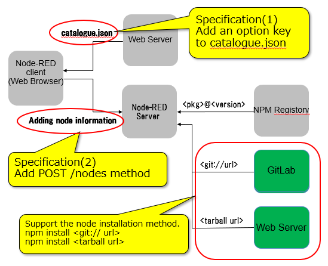

# Node installation from other than public site

## Summary
Using the function for adding nodes of "Palette", you can install your own node on Node-RED from other than public site, such as local environment.

You can install your own node from other than the public site by Node-RED settings and  preparing your own 'npm' registry. This time I am considering providing more convenient and easier install function. I propose ideas below.

### Idea
Specifying URLs for node information catalogues 

### Explanation
Allowing to add Git and tar file URLs in the catalogue.json

### Delivery Site
GitHab(GitLab) or Web Server

Supports external node modules(Tar or Git projects) installation by specifying its URL at the node installation tab on the palette management screen.

## Authors

 - @KazuhiroIto

## Details

### Adding following functions


#### Add an option key to catalogue.json

Add an option key which indicates the distribution URLs of node modules to nodes information(catalogue.json).

#### Add POST /nodes method 

An API for installation external node modules from the palette management screen. By adding distribution URL to Admin API POST /nodes, install external node modules (Tar or Git projects) .

With this additional function, support not only "npm install &lt;pkg&gt;@&lt;version&gt;" but also “npm install &lt;git://url&gt;” or “npm install &lt;tarball url&gt;” as a command executed when adding a node to Node-RED.



### Adding an option key to catalogue.json

Adding an option key **‘pkg_url’ (optional)** to catalogue.json. Specify the distribution URL to the key in the following format.

- Tar file case:  
"http[s]://&lt;Tar file distribution server path&gt;/&lt;node module file.tgz&gt;"

- GitURL case:  
"git+https://&lt;Git Server&gt;/&lt;node module project.git&gt;"

#### Example: catalogue.json
```json
{
  "name": "Node additional test catalogue",
  "updated_at": "2019-08-09T00:00:00.000Z",
  "modules": [
    {
      "description":"Node-RED Dashboard UI widget node for simple list",
      "keywords": [ "list", "item" ],
      "types": [ "ui_list" ],
      "updated_at": "2019-08-08T00:00:00.000Z",
      "id": "node-red-node-ui_list",
      "version": "0.1.4",
      "url": "https://pkg-srv /ui_list/README.md",
      "pkg_url": "https://pkg-srv/ui_list/node-red-node-ui_list-0.1.4.tgz"
    }
  ]
}
```

### Adding a function to POST /nodes method

#### POST /nodes
Request parameters for installation of a new node module.

##### The request parameters:
JSON string which has the following field.

- module:  
The name of node module to install or the full path of a directory including a node module.
- version (optional):  
The version of the node module. (The default is latest)   
This parameter is ignored when specified the full path of a directory for ‘modules’ key.  
This parameter is ignored when specified an url for **‘url’  (optional)** key.

- **url (optional)** – **NEW PARAMETER** :  
An url string for a tar file or a git project.  
When specified this parameter, the node module will be  installed from the url.  
You must define the name of a node module for ‘modules’ key.  
If not or wrong name, its upgrade results are not reported correctly.

#### Example: POST /nodes method
```json
POST /nodes
{
  "modules": "node-red-node-ui_list",
  "version": "0.1.4",
  "url": "https://pkg-srv/ui_list/node-red-node-ui_list-0.1.4.tgz"
}
```
## History

  - 2019-09-20 - Initial proposal submitted
