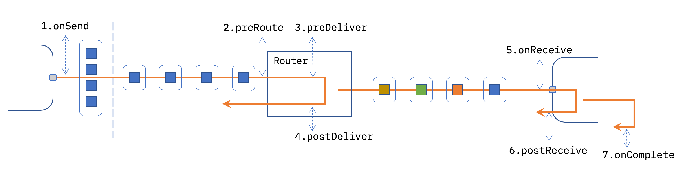

# Pluggable Message Routing

## Summary

The mechanism by which messages are passed from one node to the next should be
a pluggable component of the runtime. This would enable, for example, a flow that
spans multiple runtime instances. Other use cases:

 - flow debugger
 - adding custom low-level logging of node send/receive events including the
   full message data

## Authors

 - @knolleary

## Details

### Use Cases

#### 1. Flow debugger

 - the ability to set breakpoints in a flow that will halt the passing of messages
   and allow a user to inspect the state of the system
 - provide more detailed information about messages passing through the flows
   without having to instrument it with multiple Debug nodes.

#### 2. Flow Testing

 - inserting hooks through a flow to verify their behaviour
 - be able to stub a node in the flow with test-specific behaviour

#### 3. Flows that spanning multiple runtimes

 - instances running on separate cores routed manually or based on a policy or algorithm.
 - runtimes on separate machines in a cluster
 - runtimes in a fog deployment, e.g. on devices, gateways, cloud routed dynamically
   depending on the mobility of a device, associated connectivity, location, etc.

Note: The method for managing and distributing instances running in different cores
or machines is outside the scope of this design.


### High-level design

There are two possible models to use for the pluggable message routing feature.

1. a configurable stack of router layers
2. a set of life-cycle hooks that can have handlers attached to them

**At this stage, the life-cycle hooks approach is the preferred model.**

#### Stack of layers

The working assumption for this feature has always been to take an approach similar
to that of Express middleware:

Each message is passed to the top layer of the stack. That layer can do whatever
it wants with the message before either disposing of it or passing it on to the
next layer in the stack.

Node-RED would provide a core `LocalRouter` layer that knows how to route messages
to nodes in the local runtime.

The stack layers could be customised via either the settings file or via runtime API.

The problem with this model comes when you have unrelated things wanting to customise
the stack.

For example, if a user provided a custom layer to add additional logging, they may
specify a stack that looks like:
```
1. MyCustomLogger
2. RED.router.LocalRouter
```

They then enable the Flow Debugger that has to insert itself into this stack. That would
mean the Flow Debugger would have to keep track of the old stack configuration and be
able to restore it when the Debugger is disabled.

This could get very complicated to manage.


#### Life-Cycle Hooks

This is similar to the Fastify model of registering hooks at certain key points
in the life-cycle of a message.

Rather than leave the stack as being completely customisable, we recognise there
is a core set of steps that every message has to go through. Within those steps
are points where some custom code *might* want to run.

The following diagram shows a possible set of hook points. This list may well get
refined as the design progresses. The orange lines show the span of synchronous calls.




1. `onSend` - passed an array of `SendEvent` objects. The messages inside these objects
   are exactly what the node has passed to `node.send` - meaning there could be duplicate
   references to the same message object.

2. `preRoute` - passed a `SendEvent`

3. `preDeliver` - passed a `SendEvent`. The local router has identified
   the node it is going to send to. At this point, the message has been cloned if needed.

4. `postDeliver` - passed a `SendEvent`. The message has been dispatched
    to be delivered asynchronously (unless the sync delivery flag is set, in
    which case it would be continue as synchronous delivery)

5. `onReceive` - passed a `ReceiveEvent` when a node is about to receive a message

6. `postReceive` - passed a `ReceiveEvent` when the message has been
    given to the node's `input` handler(s)

7. `onComplete` - passed a `CompleteEvent` when the node has completed with a message or logged an error


##### `SendEvent` object

```json
{
    "msg": "<message object>",
    "source": {
        "id": "<node-id>",
        "node": "<node-object>",
        "port": "<index of port being sent on>",
    },
    "destination": {
        "id": "<node-id>",
        "node": undefined,
    },
    "cloneMessage": "true|false"
}
```
##### `ReceiveEvent` object

```json
{
    "msg": "<message object>",
    "destination": {
        "id": "<node-id>",
        "node": "<node-object>",
    }
}
```

##### `CompleteEvent` object

```json
{
    "msg": "<message object>",
    "node": {
        "id": "<node-id>",
        "node": "<node-object>"
    },
    "error": "<error passed to done, otherwise, undefined>"
}
```

##### Scenario: custom cloning behaviour

The initial logic around what messages get cloned does not change - the node
identifies if cloning needs to occur based on how many nodes it is wired to and
how many messages it is asked to send in a single go.

Rather than do the cloning, the node will set the `cloneMessage` property to indicated
whether cloning should occur or not.

The actual cloning would happen between the `preRoute` and `preDeliver` steps.

This would allow a `preRoute` handler to do its own cloning behaviour and then set
`cloneMessage` to `false` so that no further cloning would happen for that message.

One very important aspect to highlight is that messages will not be cloned until
after the `preRoute` stage - so any modifications of the message will potentially
mutate multiple messages. If earlier handlers want to modify the message in any
way, they will have to honour the `cloneMessage` flag and clone the message themselves.


##### Scenario: remote message routing

The `preRoute` step can be used to do remote message routing. As no message cloning
has happened by this point, it avoids that overhead when serialising the message
to send over the network serves the same purpose.

All steps, up to and including `onReceive` will have a way to tell the runtime to
stop processing that message and to not pass it on to any later steps. This would
allow a `preRoute` handler to decide a message must be sent to a remote runtime
and that no further local processes was needed.

##### Scenario: flow debugger - breakpoints

A breakpoint could be triggered when a node sends a message or receives one.

To break on node send, it would either register a handler on the `onSend` step
(if it was necessary to break before *any* of the messages sent in that one call
are processed) or `preRoute` if it works on a single message. That's a question
for the Flow Debugger design and doesn't need addressing now. However, the options
are there.

To break on node receive, it would register on `preReceive`.

In either case, if the breakpoint is triggered, the flow debugger needs to be able
to indefinitely halt the passing of messages.

This informs us that all of the handlers need to be able to complete asynchronously -
so the flow debugger can defer sending on any messages until it is resumed. It would
also allow the flow debugger to do step-debugging, by registering handlers at every
step.

##### Scenario: flow testing

The flow testing design introduces the ability to:
 - verify the contents/structure of a message being passed to a node
 - verify the contents/structure of a message send by a node
 - stub out an entire node with custom test-case-specific behaviour

That maps to the steps:
 - `onReceive` - verify message passed to a node
 - `onSend` - verify the message(s) sent by a node
 - `preRoute` - pass the message to a Test Stub node instead of the real node


##### Scenario: custom logging

Custom handlers added at any of the steps will be able to log whatever information
is needed.

#### Configuring Hooks

Hooks will be registered in one of two ways - either via settings file for static
configuration, or runtime API for dynamic configuration.

##### Settings file

It will be possible to register hooks via the settings file.
The names of the properties shown here still need to be decided on. This just
gives a sense of the type of thing that will be possible.

```javascript
{
    "router": {
        "onSend": [
            function(...) {  }
        ],
        "preReceive": [
            function(...) {  }
        ]
    }

}
```

##### Runtime API

 - `RED.hooks.add('<name>', function(...) { })`
 - `RED.hooks.remove('<name>')`

The `<name>` will be the name of the step to register the hook on - `onSend`, etc.

It can optionally be suffixed with a label for the hook -  `onSend.flow-debugger`.
That label can then be used with `RED.hooks.remove` to remove the handler later on.

To remove *all* hooks with a given label, `*.flow-debugger` can be used.

When invoked, the hook handler will be called with a single payload object - the details
of which will be specific to the hook.

The handler can take an optional second argument - a callback function to call
when the handler has finished its work.

When the handler finishes its work it must either:
 - return normally
 - call the callback function with no arguments
 - return a promise that resolves

Any modifications it has made to the payload object will be passed on.

If the handler wants to stop further processing of the event (for example, the Remote Router
would not want a message to pass on to the local router), it must either:
 - return `false` (strictly `false` - not a false-like value)
 - call the callback function with `false`
 - return a promise that resolves with the value `false`.

If the handler encounters an error that should be logged it must either:
 - throw an Error
 - call the callback function with the Error
 - return a promise that rejects with the Error

If a function is defined as the two-argument version (accepting the callback function),
it *must* use that callback - any value it returns will be ignored.


###### Hooks vs Events

The runtime API already provides `RED.events` where handlers can be registered
for certain runtime events. At a glance, that sounds very similar to the new `RED.hooks`
api. So it is reasonable to ask what the difference is. Here is how we distinguish
them:

 - **Events** - are *notifications* that something has happened. The event handler
   cannot have any direct influence on the event.
 - **Hooks** - are handlers that are inserted into the code path when something
   happens. The hooks can modify the data being passed through and can halt the
   onward processing


## Reference

 - https://trello.com/c/J7UDbQVP/66-pluggable-message-routing
 - https://github.com/node-red/node-red/wiki/Pluggable-Message-Routing

## History


- 2020-07-24 - Updated to add 'hooks' concept
- 2019-03-27 - Initial proposal submitted
