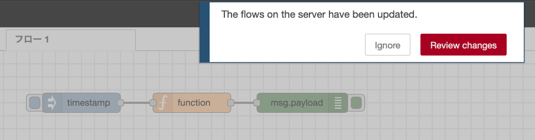
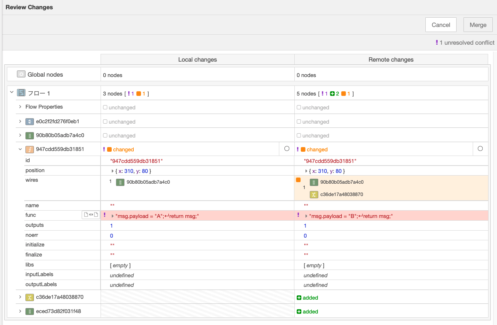
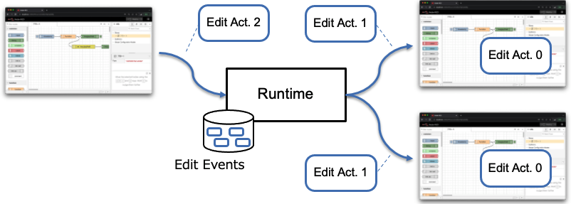
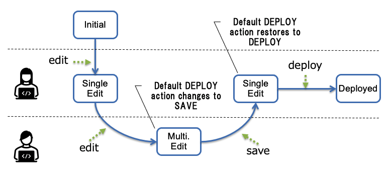
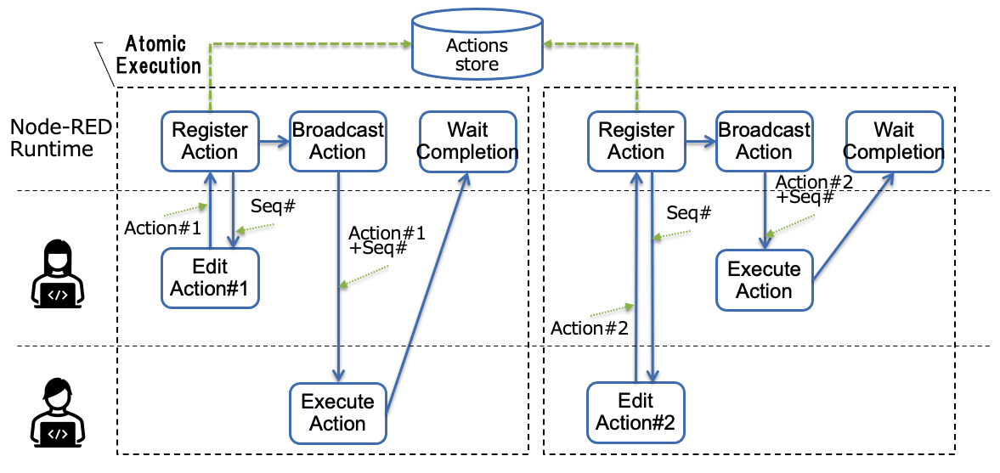
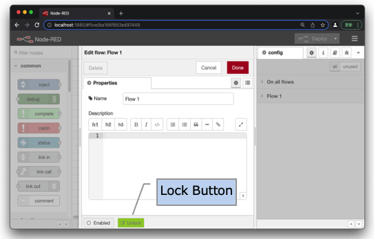
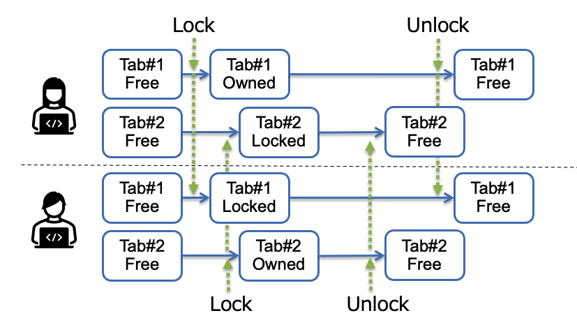
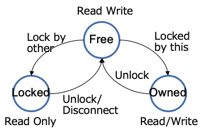

# Simultaneous Flow Editing

## Summary

With current Node-RED, multiple clients can connect to the same runtime and can edit the same flow independently.  However, editing results by multiple clients are not synchronized, so conflicts of flows occur during deployment of the flow.  There is a feature to support merging flow conflicts referring node property values, but it is difficult for end users to merge node properties in proper way.

Therefore, this design document proposes a new Node-RED editor feature that supports multiple clients to edit the same flow simultaneously.

## Authors

- Hiroyasu Nishiyama

## Proposal

Here, we consider the following two methods as candidates for simultaneous editing support of a Node-RED flow:

1. Synchronize editing actions among clients,

2. Allow locking a tab by a client to make single client can only edit the tab.

### Method1: Edit Action Synchronization

#### 1-a: Requirements

- The flow edit result of a client is immediately reflected to the flow edited on workspaces of other clients.

#### 1-b: Issues

- How to reflect flow editing state among clients?

- How to handle other kind of state changes of Node-RED including editor and runtime (e.g. node installation, execution result, etc.)?

#### 1-c: Implementation

- Extends the edit history information currently used for *undo* / *redo* of flow editing operations, and sends editing action information to other clients via the runtime.

- The client that received the edit action reproduces the flow edit result by executing the received edit action on the client browser.
  
  - In order to this properly work, ordering of edit actions are required to guarantee the order in which the edit operations are applied.
  
  - Serialization of actions are provided as a feature of the runtime.
    
    Though, there are performance concerns about this with large number of clients or slow network.
  
  - Changes other than the flow should also be treated as editing actions to be sent.  However, it is necessary not to execute anything that involves a run-time operation.

- We may need to synchronize client state at some point by sending refresh request to all client.

- Whether to use sync mode can be specified in `settings.js`.

#### 1-d: Deployment by Multiple Users

If multiple users editing the same flow at the same time,  pressing the deploy button individually may cause the deployed flow to be executed in inconsistent state.

To deal with this issue, we propose following enhancements:

1. If the first user updates the flow, the flow changes from *Initial* to *Single Edit* mode.
   Pressing *Deploy* button in *Single Edit* mode make the updated flow deployed as it does in the current Node-RED implementation and the mode changes to *Initial* mode.

2. If the second user update the flow in *Single Edit* mode, the flow state changes to *Multi. Edit* mode.
   In this mode, the Node-RED Editor's DEPLOY button defaults to **SAVE**.

3. If **SAVE** button is pressed and number of updating users become one, the mode is changed to *Single Edit*.  

4. In *Multi. Edit* mode, the user can force the flow deployed by pressing **DEPLOY** button.

#### 1-e: Managing Editing Actions

Appropriate handling of the edit actions are required to show the users a consistent editor view.  For this purpose, we will propose the following method.

- When doing an editing action, the following is exclusively performed:
1. Send the edit action to be executed from the editor to the runtime.  
   The runtime saves the action to actions store for later sending to disconnected clients and returns sequence number to the editor.

2. The runtime broadcasts the action to other clients.

3. Clients that received the broadcasted action execute the received action.

4. The runtime waits for the broadcast complete. 

- In rare cases, the atomic execution of an edit action may appear to a local edit change unexpectedly cancelled.

- If the client loses a connection, it requests and executes the edit action after the last sequence number in the runtime.

### Method2: Locking Tab

#### 2-a: Requirements

Lock the flow edit target of client A in order to suppress or notify the edit by another client B.

#### 2-b: Issues

- What to lock to edit?

- What restrictions are placed on locked targets?

#### 2-c: Implementation

- Allow each client to be able to get exclusive editing rights (*lock*) for each tab.

- Place a button to lock the tab on the settings panel of each tab.
  
  
  
  The lock button expected to have the following states:

| Tab State | Button Label | Description                   |
| --------- | ------------ | ----------------------------- |
| Free      | Lock         | Tab is not locked             |
| Owned     | Unlock       | Tab is locked by this client  |
| Locked    | Locked       | Tab is locked by other client |

    

- Tab lock state is managed by the following manner:
  
  - If a tab is locked by another client, the tab cannot be edited (**read only**).
    The tab lock request is sent to the runtime, which manages and arbitrates the state and broadcast the result to other clients.
  
  - If a client that holds a lock loses connection to the runtime, the runtime unlocks the tabs that the client is locking after a period of time.  At this point, the runtime also notifies this to other clients.
  
  - If the disconnect client reconnects, then
    
    - If the tab has not changed, regain the lock.
    
    - If the tab has changed, perform the conventional node merge process
       (*the same issues of flow conflict resolution remain in this case*)

- To make each tab editable by separate clients, it is desirable to divide the flow file into tab-by-tabs.

- The initial state of the tab can be set to *Read Only* by `settings.js`. In this case, the user need to lock the tab before updating the flow in the tab.

- Whether to use lock mode can be specified in `settings.js`.

## Discussion

- The problem with method 2 is that conflicts may occur when locks are not acquired and a flow is edited by multiple clients.  So, there still exist the same issues with current Node-RED implementation when conflicts occur.

- Compared with method 2, method 1 has to serialize and broadcast the edit actions to all connected clients. This may cause a performance concern when the number of clients increases.  
  
  However, method 1 seems to be more intuitive for users.  So, I would like to recommend this method as a means for simultaneous flow editing.

- It is conceivable to restrict the forced release of the lock to the admin user. However, there is no way to distinguish users in the current Node-RED.

## History

- 2022-01-30 - Initial proposal
- 2022-02-24 - Update design proposal
