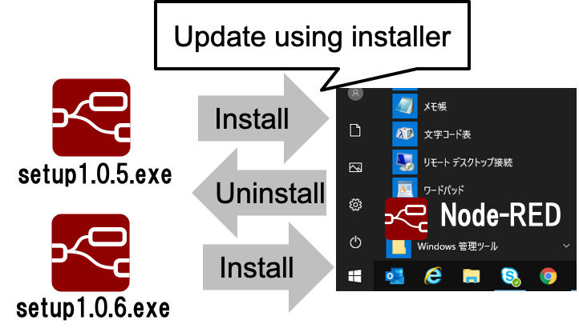
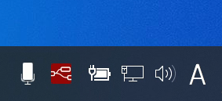
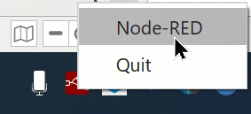

# Node-RED installer

## Summary

The Node-RED installer is a single installer file to sets up the Node-RED environment.

## Authors

 - @kazuhitoyokoi

## Use Cases

  - Easy installation

    With the Node-RED installer UI, it will be easy for users to set up the Node-RED environment.
    Especially, the target users are beginners who have no CLI skills to install Node-RED using commands like `npm install`.

  - Offline installation

    It is suitable for offline use cases because it contains Node.js necessary components to execute Node-RED.
    If needed, Node-RED nodes can also be included in the installer by custom building.

##  Scope

### Installer
- Installer sets up Node-RED application to a user environment.
- Easy update using installer including nodes.

Fig.1 Installer

### Behaviors

After installing the Node-RED environment, it behaves as a server.
To identify server the process from users, there is a Node-RED icon on the task tray area.

 

Fig.2 Icon on the task tray

The Node-RED icon has the menu to handle the Node-RED environment.
As the minimum options, users can select the option to open Node-RED on the default browser or the option to stop the Node-RED server.

### Prerequisites
  The Node-RED installer already has included both Node.js and Node-RED.
  Therefore, Node.js is not required when users develop the flow using default Node-RED nodes on the palette.

- Node.js

  If users want to install additional Node-RED nodes to your Node-RED environment built by the installer, they need the npm command.
  [Node.js installer](https://nodejs.org/) which have been provided by the Node.js community sets up both Node.js and npm command but it is useful for installing npm command rather than Node.js in the Node-RED installer case.
  The Node.js installer is a simple way to prepare the npm command because the installer UI is easy to operate.
  (Node-RED installer can include npm module as dependencies in package.json file but API of the npm module seems not to be public.
  To avoid the sudden API change in the future, the npm module is not suitable for the installer.)

- Git command

  If users would like to use the project feature, they need the git command.
  On Windows environment, users install git command by [git installer](https://git-scm.com/).
  For macOS users, Xcode is an easy way to install the git command.
  The Node-RED environment prepared by the installer will enable the project feature when the git command exists.

### Logging
  For investigating error logs by other users, the standalone Node-RED outputs the logs to files with log rotate style.

## Details
### Node.js in Node-RED installer
  The Node-RED installer includes the latest LTS version of Node.js.
  In the Electron project, the higher version of the LTS is used among the two LTS Node.js.
  In terms of the Node.js version, there is no relation between Node.js in the installer and Node.js which was installed by the Node.js installer.
  (In the node installation process only, later Node.js is used via npm command internally.)

### Node-RED node installation
  The npm command installs Node-RED nodes for Node.js which is installed with the npm command by the Node.js installer.
  If there is binary code in the Node-RED node, the rebuilding process is required.
  There are the following cases when the process is needed.

  - Rebuilding Node-RED node

    After installing the Node-RED node using the npm command, `electron-rebuild` rebuilds the node to compatible with Node.js in the Electron.
    To realize the handling,  `postInstall` in RED.hooks API will be used.

  - Rebuilding all Node-RED nodes

    In case of upgrading the Node-RED installer in the future, installed Node-RED nodes should be rebuilt because they will not be compatible with the upgraded Node.js.
    This case will occur when the major version of Node.js is changed only.
    Therefore, the first version of the Node-RED installer doesn't need to care about the handling.

### Runtime
  The Node-RED runtime will be executed as a single instance.

  Instead of default `~./node-red/` directory, the Node-RED uses `~./node-red-standalone/` directory to avoid changing the default environment under `~/.node-red/` directory. 
  When there is no `settings.js` file under `~/.node-red-standalone/` directory, the standalone Node-RED saves the default `settings.js` file to load the custom settings in the following table.

  | key                          | value |
  | ---------------------------- | ----- |
  | editorTheme.projects.enabled | true  |

### Logging
  Users can also see historical log data from log files.
  If the `electron-log` module is used to implement logging functionality, the following paths are default file paths to store log data.

  - Windows: C:\Users\\< User name >\AppData\Roaming\node-red\logs\file.log
  - macOS: ~/Library/Logs/node-red/file.log
  - Linux: /var/log/node-red.log

### Building binaries
  `npm run build` command builds binaries for the following OS environments.

  - Windows (msi)
  - macOS (dmg)

  The procedures about how to build other binaries like deb and rpm will be available in the documentation.

## History

  - 2021-11-30 - Initial proposal
