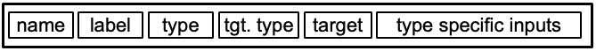
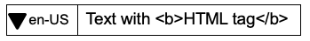
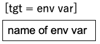
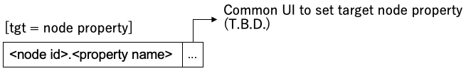
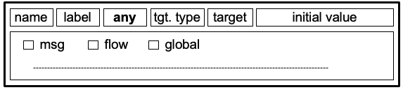
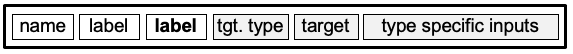
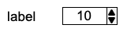
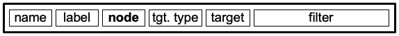

## Subflow Property UI

### Summary

0.20 introduces subflow instance properties. They are exposed as a list of key/value
pairs in the subflow edit dialog.

There is a requirement to be able to generate a richer UI interface for the user
to set these properties.

### Authors

 - @HiroyasuNishiyama

### Details

### UI definition

Next figure shows a process to define new parameter settings UI for a SUBFLOW.

**UI Edit Panel** is added to **SUBFLOW Template Edit Panel** of a SUBFLOW.  Simple parameter setting UI for the SUBFLOW can be created using this panel by adding UI items on UI items list.  Created UI can be previewed by clicking **preview** button or selecting preview tab.

Parameter settings UI of a SUBFLOW can be show by double clicking the SUBFLOW (and selecting parameter edit tab) on flow edit pane.  SUBFLOW customization parameters can be set using this UI.

#### SUBFLOW Parameter Representation

Each UI item defined in UI Edit Panel can store the defined value into two kinds of targets: SUBFLOW environment variable and node property within the SUBFLOW.

#### Edit UI Panel

**Edit UI Panel** have **add** button at the bottom.  By clicking this button, new UI item  can be added to UI items list.  UI items are shown from top to bottom in generated parameter settings UI.  Order of UI items can be rearragned by dragging an item in the list.

UI item definition consists of following sub-items:

- **name** - name of defined UI item. Used to access input value.

- **label** - label of defined UI item.  HTML tags can be used in label definition.  For internationalization (i18n) of label text, locale of the text can be selected from menu.

  **label** field appearance is as follows:

  

- **type** - type of defined item. Currently following types are supported:

  | type              | input item                                          | description                                                  |
  | ----------------- | --------------------------------------------------- | ------------------------------------------------------------ |
  | *simple type*     | - initial value                                     | simple input for basic types supported by TypedInput such as string, number, etc. |
  | **any**           | - selection of candidate types - initial value | set of basic types supported by TypedInput                   |
  | **label**         | -                                                   | only show label                                              |
  | **menu**          | - menu items - initial value                   | select one item from list of menu items                      |
  | **checkbox**      | - label - initial value                        | checkbox to select from items                                |
  | **spinner**       | - initial value                                     | spinner input of numeric value                               |
  | **node**          | - target node                                       | select from set of nodes                                     |
  | **node property** | - target property of a node                         | select from set of node properties                           |
  | **ui_group**      | - group of UI widget                                | select group of Node-RED Dashboard                           |
  | **ui_size**       | - size of UI widget                                 | set size of Node-RED Dashboard UI Widget                     |

  **type** field appearance is as follows:

  

- **tgt. type** - type of target to which input value is stored.  Curtly supported tgt. types are as follow:

  | name          | description                             |
  | ------------- | --------------------------------------- |
  | env var       | environment variable                    |
  | node property | property of a specified node in SUBFLOW |

  There are some kind of UI input types of nodes in SUBFLOW that can not be specified using environment variable.  For such input type, we allow directly specifying property of nodes from node settings UI.  

  **tgt. type** field appearance is as follows:

  

- **target** - specification of target for selected **tgt. type**.

  If **tgt. type** is **env var**, **target** field appearance is as follows:

  

  If **tgt. type** is **node property**, **target** field appearance is as follows:

  

- **type specific inputs** - input items specific to each UI item type.

#### UI Input Elements

This section describes UI definition, UI appearance, and environment variable defined by UI element for each UI input element type.  

##### *Simple Type*

- UI Definition

  

  - **initial value** accepts a value of type specified by **<type>** field.

- UI Appearance

  

- Environment Variable

  | name        | value                                                        |
  | ----------- | ------------------------------------------------------------ |
  | *name*      | input value represented by specified type                    |
  | *name*_type | type of input value                                          |
  | *name*_info | JavaScript object that represents input information.  It contains following properties: - name: name of field - label: label of field - value: input value - type: type of UI element - target_type: “env var” or “node property” - target: name or [id, name] |

##### **any**

- UI Definition

  

  - A set of candidate types can be selected by checkbox.
  - Initial value can be defined using **initial value** field.

- UI Appearance

  

  - A value can be input using **TypedInput** interface.

- Environment Variable

  same as *simple type*

##### **label**

- UI Definition

  

- UI Appearance

  

- Environment Variable

  | name        | value                                                        |
  | ----------- | ------------------------------------------------------------ |
  | *name*_type | “label”                                                      |
  | *name*_info | JavaScript object that represents input information.  It contains following properties: - name: name of field - label: label of field - type: “label" |

##### **menu**

- UI Definition

  

  - menu items are defined by adding *item label* (with locale) and its *value* pair.
  - initial value of menu can be defined using **initial value** menu.

- UI Appearance

  

- Environment Variable

  | name        | value                                                        |
  | ----------- | ------------------------------------------------------------ |
  | *name*      | *value* of selected item                                     |
  | *name*_type | "menu"                                                         |
  | *name*_info | JavaScript object that represents input information.  It contains following properties: - name: name of field - label: label of field - value: value of selected item - type: “menu" - target_type: “env var”, “node”, or “node property” - target: name or [id, name] - items: list of objects with following properties:   + labels: list of objects with following properties:      * lang: locale of label      * label: label   + value: value of item |

##### **checkbox**

- UI Definition

  

  - initial value (**true** or **false**) can be defined by **initial value** field.

- UI Appearance

  

  - item label is shown after check box.

- Environment Variable

  | name        | value                                                        |
  | ----------- | ------------------------------------------------------------ |
  | *name*      | **true** or **false**                                        |
  | *name*_type | “checkbox”                                                   |
  | *name*_info | JavaScript object that represents input information.  It contains following properties: - name: name of field - label: label of field - value: **true** or **false** - type: “checkbox" - target_type: “env var” or “node property” - target: name or [id, name] |

##### spinner

- UI Definition

  

  - initial value can be defined by **initial value** field.

- UI Appearance

  

- Environment Variable

  | name        | value                                                        |
  | ----------- | ------------------------------------------------------------ |
  | *name*      | numeric value                                                |
  | *name*_type | “spinner”                                                    |
  | *name*_info | JavaScript object that represents input information.  It contains following properties: - name: name of field - label: label of field - value: numeric value - type: “spinner" - target_type: “env var” or “node property” - target: name or [id, name] |

##### node

- UI Definition

  

  - **filter** specifies a regular expression that filters node type.

- UI Appearance

  

- environment variable

  | name        | node ID                                                      |
  | ----------- | ------------------------------------------------------------ |
  | *name*_type | "node"                                                  |
  | *name*_info | JavaScript object that represents input information.  It contains following properties: - name: name of field - label: label of field - value: numeric value - type: “node" - target_type: “env var” or “node property” - target: name or [id, name] |

##### node property

*T.B.D.* (will be implemented as an extension of **TypedInput** interface)

## History

  - 2019-02-27 - migrated from Design note wiki
