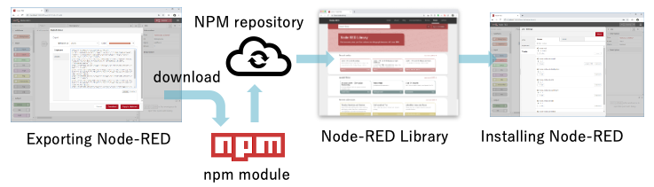
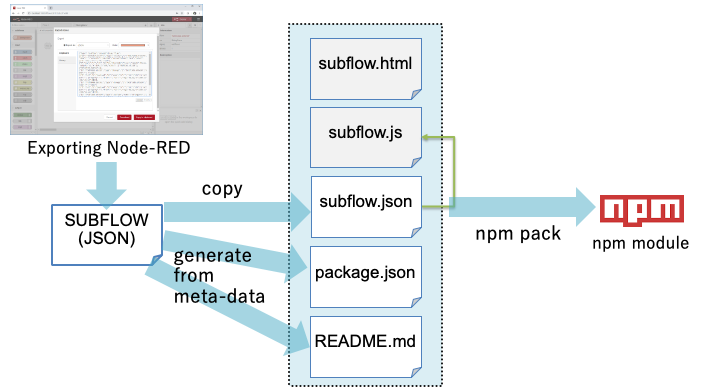

# Converting Exportable SUBFLOW to NPM

This proposal covers how a Exportable SUBFLOW can be converted to NPM module.

Currently Node-RED nodes are distributed as NPM module.  There is a design proposal that enable a SUBFLOW to be exported as a node in JSON format (https://github.com/node-red-hitachi/designs/blob/subflow-encryption/designs/exportable-subflow/README.md).

Even if redistributing SUBFLOW in JSON format is possible, it is useful to convert it to NPM format for the following reasons:

- automatic detection of node update,
- embedding example flows, 
- listing in flow library by crawling npm repository,
- ...

Therefore, this design note proposes a method of converting JSON-formatted SUBFLOW nodes into NPM modules.



### Authors

 - @HiroyasuNishiyama

### Details

#### Node API for installing SUBFLOW node

Current Node-RED API for installing nodes only accepts JavaScript/HTML description of nodes.  To cope with this, we introduce a new API that accepts and installs JSON format SUBFLOW representation.

- `RED.nodes.registerSubflow(`*\<SUBFLOW definition\>*`)`

  This API is called from the JavaScript file that correspond to installed node.

#### SUBFLOW NPM Module

Command-line tool or editor support is provided that converts SUBFLOW JSON representation to SUBFLOW NPM module.  Converted SUBFLOW NPM module contains following contents:

- *\<SUBFLOW\>*`.json`

  Exported SUBFLOW JSON definition

- *\<SUBFLOW\>*`.js`

  Template code that loads `SUBFLOW.json` and call `registerSubflow` API.

- README.md

  Generated from SUBFLOW matadata (description property)

- package.json

  Generated from SUBFLOW metadata. 

  **Example**

  ```
  {
      "name": <exportName>,
      "version": <version>,
      "description": <description>,
      "dependencies": [list of depending modules],
      "keywrods": <keywords>,
      "node-red": {
          "subflows": {
            <name>: <SUBFLOW>.js
  　　　　}
      }
  }
  ```

  JavaScript module is listed in `node-red.subflows` property.  This distingishes normal node module and SUBFLOW node module.

  The `dependencies` property points to array of depending modules.  This information is extracted from imported module list of function nodes.  This is covered by separate design note on extension of function node (https://github.com/node-red/designs/pull/22).

HTML file is not required by SUBFLOW node module because editor-side UI information is contained in JSON representation.




## History

  - 2020-02-23 - initial design note
