## Enhancement of some nodes for 'Timeout' flows.

### Summary
Sometimes a function in a node takes a longer time to process. In this case, a lot of flow developers want to treat this behaviour as a timeout error. In this document, I would like to describe enhancements of some nodes for 'timeout' flows.

### Authors
 - @KazumiYoshida
 - @YumaMatsuura

### Details
Timeout processing can be performed by using a delay node. This timeout flow is shown in the following URL:

https://medium.com/node-red/node-red-design-patterns-893331422f42 (timeout pattern)

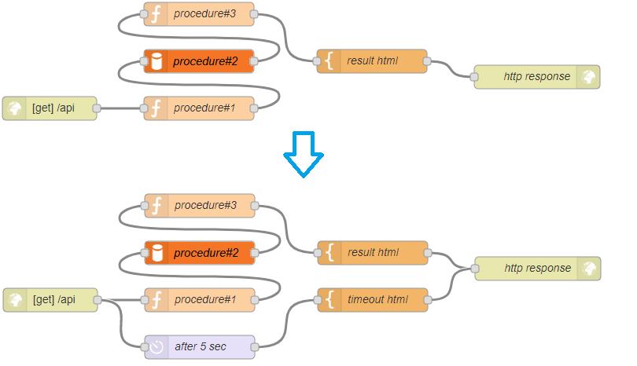

Figure 1. Timeout pattern

In the above case, the "http response" node will accept a message from the "timeout html" node after 5 second if a processing in the "procedure#1" node takes time. This behaivour dose not guarantee that the "procedure#2" node never receive a message from the "procedure#1" node. After the processing in the "procedure#1" node finished, the "procedure#2" receives a message. It could be inconsistent that the node updates a result of the "procedure#1" node even though the "http response" node replied timeout html.

To prevent this behaviour, a flow developer inserts a special function nodes in the flow. An example is shown below. 

 
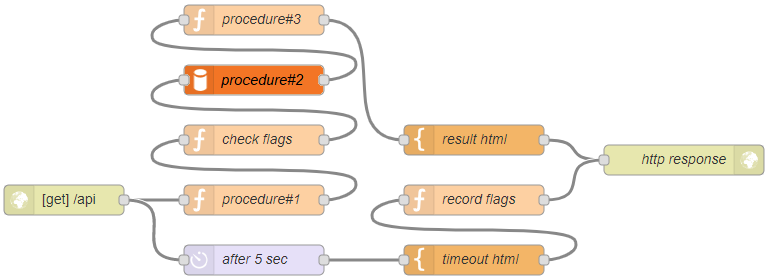

Figure 2. Inserted function nodes

The "record flags" node writes 1 as a flag value in the flow context, for example, and the "check flags" node checks the flag existence and its value to decide to send a message to the next node or not. Putting it the other way around, receiving a message from the "timeout html" node after replied within 5 seconds is no meaning. Like this, a node that only passes the same message once is required.

To simplify these behavious, suggest an idea which is to provide "once" node for "timeout" flows.

 
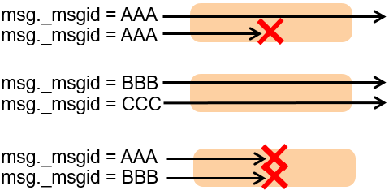

Figure 3. "once" node's behaviour

This node passes a message only once to the next node. Once this node passed a message which has "AAA" as a message id, this node never passes a message which has the same message id.

 
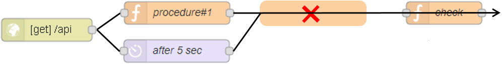

Figure 4. Flow using the "once" node.

In above case, the "check" function node have to check where the message come from. If the message comes from the "delay" node, the "check" function node can call "error()".

#### Suggestion#1:
Adding an option on ‘join’ node to behave oppositely. A existing ‘join’ node waits for multiple messages and combines them, but this option allows one to behave an opposite action. The 'join' node with this option only waits for same messages and passes one of messages to the next node. The others are ignored and not passed to the next node. By checking a message id(msg._msgid), this node decides whether passes the message to the next node or not.

In addition, to measure time precisely, need to some enhancements of "delay" node or one of the other nodes.

 
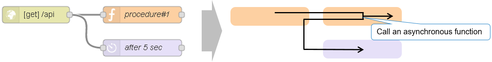

Figure 5. Actual sequence

If an asynchronous function in the 'procedure#1' node is not called, the delay node won't be called. In the meantime, a time lag occurs.

#### Suggestion#2:
Adding an option on ‘trigger’ node to allow "trigger" node to have a second connection point. A ‘trigger’ node with the option sends a message to the first connected node at the very beginning. When a timer expires, the node passes the message to the other connected nodes, not the first one. We can measure the time precisely by this enhancement.

#### Enhancement of "join" node:
A "join" node waits for multiple messages and combines them. Adding an option on the node, this node behave an opposite action. The node with this option will pass through a message to the next node only once. After that, the node will ignore the same message.

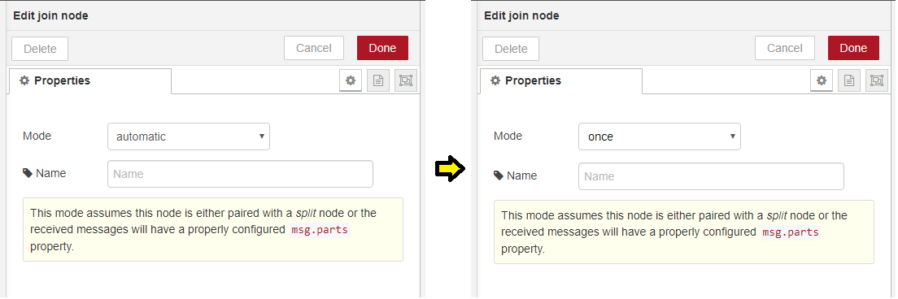

Figure 6. Adding "once" option on "join" node

#### Enhancements of "trigger" node:
A "trigger" node pass a message to the next node, and wait for the defined time to send a message again. Adding options, which are "discrete outputs" and "memorize message ids", on the node, this node sends 2nd message to the other wired node, and memorise the message id in the flow context.

 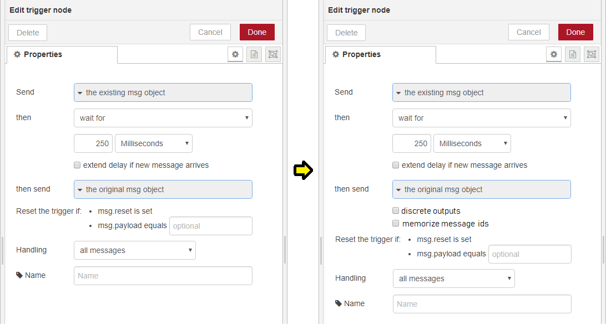

Figure 7. "discrete outputs" & "memorize message ids" option

 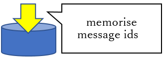

Figure 8. memorise message ids

If "discrete outputs" option is selected, 2 joint points appear on the edge of "trigger" node. A "trigger" node with the option will send 1st message to the 1st wired node, and send 2nd message to the 2nd wired node after the time expired. If "memorize message ids" option is selected, A "trigger" node save the message id (msg._msgid) in the flow context.

#### Enhancement on "join" node (2):
A "join" node with the "once" option deletes the message id when finds the same message id in the flow context, and then passes the message to the next node. If the "join" node can't find the same message id, the message will be ignored.

A "trigger" node with the options memorises a message id in the flow context, and a "join" node with the option delete the message id in the flow context. This mechanism is very import for resources of Node-RED. If a "join" node with the option kept the message id to compare with another message to decide to pass it or not, a lot of message ids would be stored in the flow context.

#### Example:
 
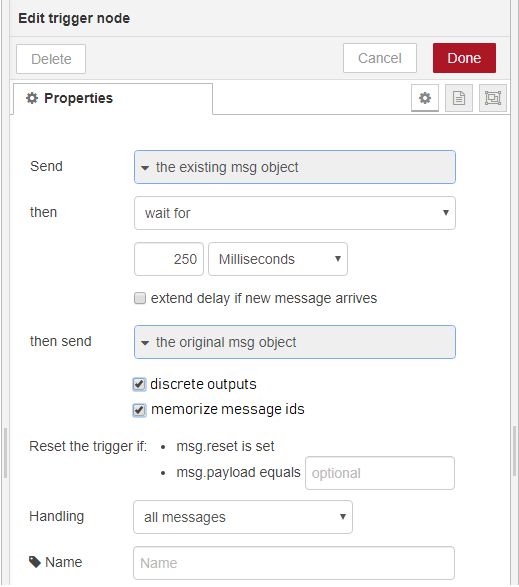

Figure 9. select "discrete outputs" and "memorize message ids" options

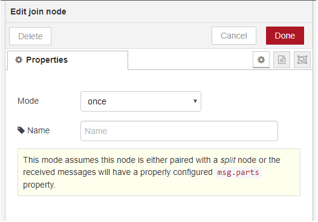

Figure 10. select "once" option

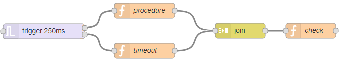 

Figure 11. Timeout flow

In above case, the "trigger" node sends a message to the "procedure" node, and keeps its id in the flow context. The "procedure" node sends the message to the "join" node. The "join" node trees to find its id in the flow context. If the "join" node could find it, the message would be sent to the "check" node and the "join" node would delete the id in the flow context. After 250ms, the "trigger" node sends the same message to the "timeout" node, and the "timeout" node writes "payload=timeout" and sends it to the "join" node. the "join" node cannot find the message id because the id was already deleted. The message will be ignored.

If a function in the "procedure" node takes time, the "join" node will accept a message from the "timeout" node. Then the "join" node find the same id in the flow context and send it to the "check" node. A the same time, the "join" node deletes the id in the flow context. The "check" node checks where the message comes from. After that the "check" node will be able to deal with a timeout error.

## History:
 - 2019-09-19 - Initial proposal submitted

