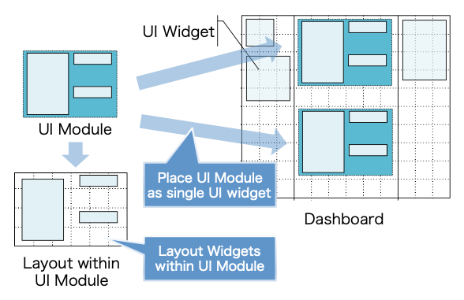
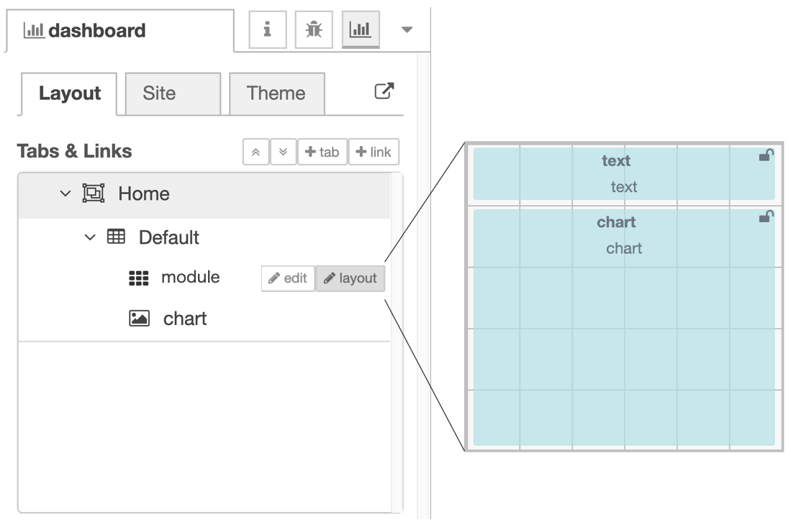
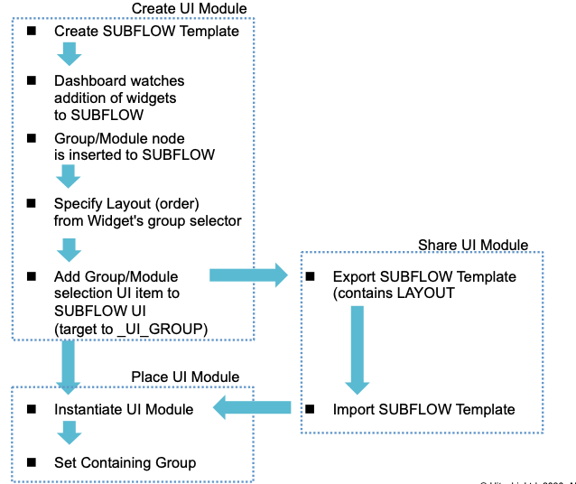

# UI Module

Node-RED Dashboard is convenient tool for creating GUIs.  But creating
complex dashboard screen is difficult with current Node-RED Dashboard
because the screen should be created by combining basic set of
dashboard widgets.  This design note is aimed at addressing this
problem by providing UI module that creates reusable UI components
consisting of existing UI widgets.

## Summary

**UI module**(or compound widgets) is a visual components of Node-RED
Dashboard that made up of multiple widgets.  Each UI module is a group
of widgets that meets a particular needs in terms of the information
it conveys or how it is viewded.

UI module has its own internal layout of contained UI widgets.  It can
be placed on dashboard similar to UI widgets.



Extension of SUBFLOW mechanism naturally fits for defining UI Module in Node-RED.  This needs following problems to be solved:

1. SUBFLOW template should be able to contain multiple widgets and their layout,
2. SUBFLOW instance should be able to specity a group (or possibly other SUBFLOW template) that contains it,
3. SUBFLOW template and its layout information should be able to exported as an exportable SUBFLOW,
4. UI widgets within UI Module 
5. 1~4 should be implemented on Node-RED runtime/editor without dependency on Node-RED Dashboard.

### Creating UI Module

To solve these problems, we introduce new UI Module config node (or extend Group node).  The UI Module node contains layout information of contained widgets (i.e. module's width/height and ordered list of the widgets).   The settings panel of the UI Module node provides layout editing UI that consists of size information and order of contained widgets.  It also provides a graphical UI layout editor intraface.



Instead of using order information contained as a propoerty of each widget node, we move order information of widgets to UI Module config node and Group node.  The order property will be deprecated in later revision of Node-RED dashboard.  

Example of dashboard layout information:

```
tab
 ┣ group {width:.., order: [W1, W2]}
 ┃   ┣ widget {width:.., height:.., id: W1}
 ┃   ┗ widget {width:.., height:.., id: W2}
 ┗ group {width:.., order: [M1, W3]}
     ┣ module {width:.., height:.., id: M1, order: [W4, W5]}
     ┃   ┣ widget {width:.., height:.., id: W4}
     ┃   ┗ widget {width:.., height:.., id: W5}
     ┗ widget {width:.., height.., id: W3}
```


While editing SUBFLOW template, Node-RED Dashboard watches addition of widgets to a SUBFLOW.  If it detects an addition of a widget, it inserts an UI Module config note to corresponding SUBFLOW (i.e. *z* of UI Module = *id* of SUBFLOW template) if none already registered.  

SUBFLOW template should contain UI group selector item in  its settings UI.  It must target to a special environment variable (`_UI_GROUP`).  This variable points to group node instance and is used to layout UI Module instance.

From settings panel of a widget that belongs to the UI Module, users can only specify contained UI module from its group selector. 



### Placing UI Module

UI Module can be instantiated from SUBFLOW template in editor pallette.  Users can specify containing group from its settings menu but can not edit internaal layout of the UI Module.

On dashboard layout sidebar (or dashboard layout tool), contained widgets are not displayed and only UI module is displayed.

### Sharing UI Module

UI Module can be exported as an exportable SUBFLOW.  Since layout information is held as a configuration of UI Module config node, we do not need to extend exporting mechanism for this purpose.

## Authors

 - @HiroyasuNishiyama

## Details


## History

  - 2020-02-10 - Initial Design Note
