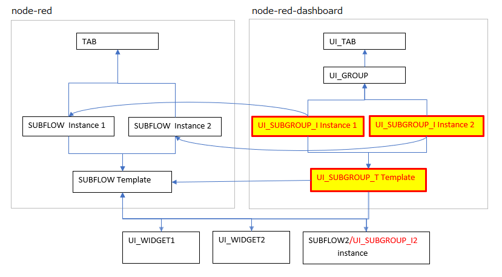
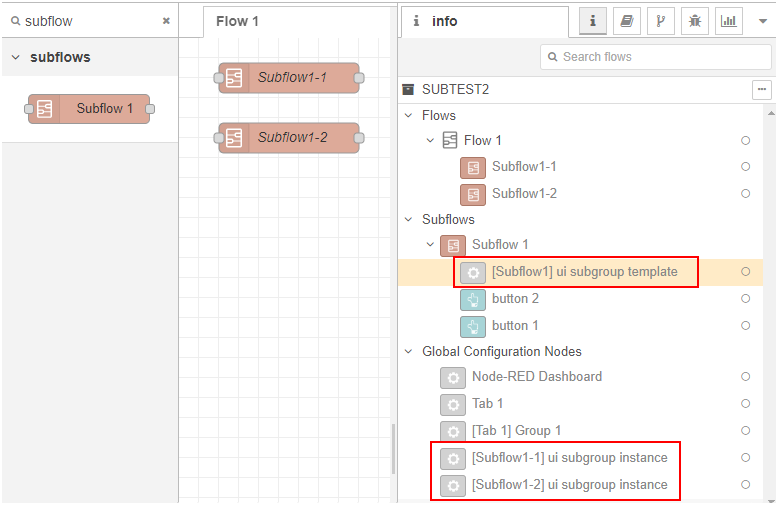
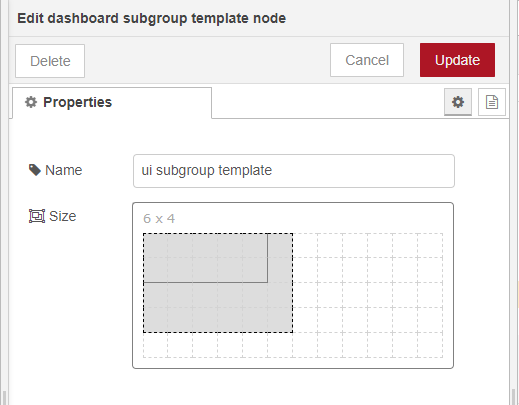
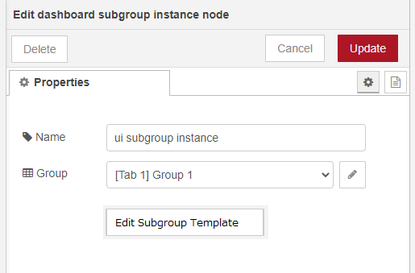
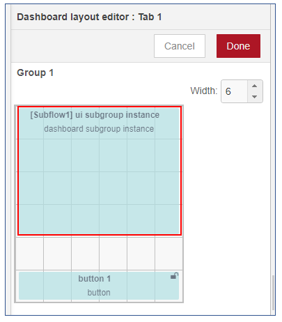
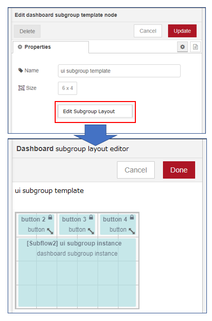
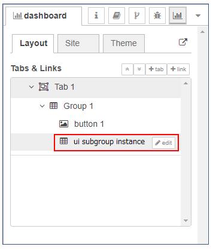

# UI Module 

Node-RED Dashboard is convenient tool for creating GUIs.  
But creating complex dashboard screen is difficult with current Node-RED Dashboard because the screen should be created by combining basic set of dashboard widgets.  
This design note is aimed at addressing this problem by providing UI module that creates reusable UI components consisting of existing UI widgets.

## Summary

UI module(or compound widgets) is a visual components of Node-RED Dashboard that made up of multiple widgets.  
Each UI module is a group of widgets that meets a particular needs in terms of the information it conveys or how it is viewded.  
UI module has its own internal layout of contained UI widgets. It can be placed on dashboard similar to UI widgets.


Extension of SUBFLOW mechanism naturally fits for defining UI Module in Node-RED.  
This needs following problems to be solved:

1. Group multiple widgets or other SUBFLOW instances defined in SUBFLOW template so that they can be treated as a single widget as UI module,

2. UI module specifies the UI_GROUP of Node-RED dashboard to which it belongs, or makes it automatically belong to UI module of SUBFLOW template that is placed.

3. UI module should be able to place on dashborad similar to UI widgets,

4. SUBFLOW template and its layout information should be able to exported as an importable SUBFLOW,

5. 1~4 should be implemented on Node-RED Dashboard without dependency on Node-RED runtime/editor.

## Author
 - @HiroyasuNishiyama
 - @KazuhiroIto

## Details

### Composition of UI module

SUBFLOW instantiates the node defined in the template to generate the node entity.  
Widget node has layout information for each node definition, but when multiple instances are created from the same template, there is a problem that it cannot be placed arbitrarily for each instance because it cannot have layout information for each widget node.
Therefore, add the following "Config node for UI module" to Node-RED dashborad to allow any layout for Widget placed in the SUBFLOW template.  

- UI_SUBGROUP_T template node  
  A node that has layout information of widget node that belongs to the SUBFLOW template.

  It is generated one-to-one with the SUBFLOW template.

- UI_SUBGROUP_I instance node  
  A node that has information such as the UI_GROUP node to which UI_SUBGROUP_T belongs.

  It is generated one to one with the SUBFLOW instance.

Config node for UI module:


#### Creating config node for UI module

"Config node for UI module" is automatically generated according to the addition of SUBFLOW template and SUBFLOW instance.  
Node-RED dashboard automatically adds "Config node for UI module" similar to the behavior of automatically adding config node(ui_base node).  
The added config node settings can be referenced and edited from the "Info" tab on the sidebar or the "Node Settings" menu screen.  
Also, when SUBFLOW template or SUBFLOW instance is deleted or edited, the corresponding "Config node for UI module" is automatically deleted or edited as well.

Reference example from "Info" tab on the sidebar:  


#### UI_SUBGROUP_T template node

UI_SUBGROUP_T node provides information for treating multiple widgets belonging to SUBFLOW template as UI module as if they were a single widget.  
Node-RED dashboard reflects information on UI_SUBGROUP_T template node according to addition of SUBFLOW template and addition/deletion of widgets that belong to it.  
It has the following information.

- Arrangement information of widget node belonging to SUBFLOW template (array of ID of widget or UI_SUBGROUP_I instance)
- Width and height of the area where UI module is placed
- Corresponding SUBFLOW template reference

Example of UI_SUBGROUP_T template node:
```
{
  "id": "<UI_SUBGROUP Template ID>",
  "type": "ui_subgroup_t",
  "z": "<SUBFLOW Template ID>",
  "name": "ui subgroup template",
  "widgetOrder": [
    "<WIDGET ID>or<UI_SUBGROUP instance ID>","...","...",...
    ],
  "width": 6,
  "height": 6,
  "subflow": "<SUBFLOW Template ID>"
},
```

#### UI_SUBGROUP_I instande node

UI_SUBGROUP_I node provides the information to place on Node-RED dashboard when UI module is instantiated.  
Node-RED dashboard adds UI_SUBGROUP_I instance node according to SUBFLOW instance addition.  
This node is treated like a single widget when placed in Node-RED dashboard.

It has the following information.
	
- Information of UI_GROUP node to which UI_SUBGROUP_I belong
- Reference to SUBFLOW instance
- Reference to UI_SUBGROUP_T node

Example of UI_SUBGROUP_I instance node:
```
{
  "id": "<UI_SUBGROUP Instance ID>",
  "type": "ui_subgroup_i",
  "z": "<SUBFLOW Template ID> or Empty",
  "name": "ui subgroup instance",
  "group": "<UI_GROUP ID>",
  "order": 0,
  "subflow": "<SUBFLOW Instance ID>",
  "subgroup": "<UI_SUBGROUP Template ID>"
},
```

### How to handle widget belonging to UI module

The designation of UI_GROUP is invalid for widget placed in SUBFLOW template.  
Since UI_GROUP is a required parameter, some groups are specified, but the specified value is ignored.  
Instead, it belongs to UI_SUBGROUP_T template node which is automatically generated for each SUBFLOW.  
In this case, do not use the order value of widget for the placement of widget, and place it in the order of the corresponding subscript of widget in the widgetOrder array of UI_SUBGROUP_T template.  
The same applies to UI_SUBGROUP_I instance placed in SUBFLOW template.

Example of widget node:
```
{
  "id": "<Widget ID>",
  "type": "ui_button",
  "z": "<SUBFLOW Template ID>", ・・・　Set ID of SUBFLOW *1
  "name": "Button1",
  "group": "<UI_GROUP ID>",  ・・・ It is invalid in case of *1 (* Use group of UI_SUBGROUP_I)
  "order": 0,    ・・・ It is invalid in case of *1 (* Use widgetOrder of UI_SUBGROUP_T for placement)
  "width": 4,
  "height": 1,
  :
},
```

#### UI module function edit screen

1. UI_SUBGROUP_T template node edit screen  
You can change the size of the widget placement area in template.  
Use elementSizer to resize.  
(In elementSizer, we will consider adding a function that disables automatic size setting and allows setting of arbitrary size)  
Specification of width and height that widget belonging to UI_SUBGROUP_T template does not fit is restricted.  
UI_SUBGROUP_T template node edit screen:  


2. UI_SUBGROUP_I instance node edit screen  
Set UI_GROUP to which UI module belongs. UI_GROUP is optional.  
If not specified, the target UI module is not displayed in dashboard.  
If the width of the selected UI_GROUP is smaller than the width of the size set for UI_GROUP_T, the setting is limited.   
If another SUBFLOW instance is placed on SUBFLOW template, the value of UI_GROUP set on this screen becomes invalid.  
The UI_GROUP of UI_SUBGROUP_I instance corresponding to the placed SUBFLOW instance is automatically updated with the ID of UI_SUBGROUP_T node corresponding to the SUBFLOW template on where SUBFLOW insntance is placed.  
You can open the edit screen of UI_SUBGROUP_T template node by pressing the [Edit Subgourp Template] button.  
UI_SUBGROUP_I node edit screen:  


3. Dashboard layout editor  
Corresponds to the UI Module layout.  
The size of UI module is fixed and cannot be changed.  
Layout editor screen example when UI_SUBGROUP is included:  


4. UI module layout editor  
Layout editor to edit the layout of UI module.  
The layout of UI module can be edited by pressing the [Edit Subgroup Layout] button from the edit screen of UI_SUBGROUP_T template node.  
The size of UI module can be edited within the width and height of UI_SUBGROUP_T template node.  
The width on the editor is fixed. Also, editing the layout is limited to the height specified by the size.  
The edited result is reflected in the array value of "widgetOrder" of UI_SUBGROUP_T node.  
SUBGROUP layout editor screen:  
  
*It is possible to support the layout editing function using the tree UI in dashboard layout sidebar, but here we will consider support separately.

5. Dashboard layout sidebar  
In dashboard layout sidebar, UI_SUBGROUP_I instance can be placed under the group.  
Widget contained in UI_SUBGROUP_I instance is not displayed, only UI_SUBGROUP_I instance is displayed.  
Pressing the [edit] button opens the edit screen for UI_SUBGROUP_I instance.  
Layout Tabs & Lynks editor:  
   
*UI_SUBGROUP_I instance settings can be edited with the [edit] button on this screen.  
To edit the layout of UI module(Template), open the UI_SUBGROUP_T template edit screen from the instance screen and press the [Edit Subgroup Layout] button to open the layout screen.

### UI module function operation procedure

The operation procedure when the user arranges the UI module on the dashboard is shown below.  

1. Create SUBFLOW template  
The user creates SUBFLOW template and places widget.

2. Edit UI_SUBGROUP_T template  
In step 1, Node-RED dashboard automatically creates UI_SUBGROUP_T template.  
The user can edit the layout of UI module by opening the edit screen of UI_SUBGROUP_T template node from the node "info" tab.  

3. Create SUBFLOW instance  
Place SUBFLOW instance on tab or on SUBFLOW template.

4. Edit UI_SUBGROUP_I instance  
In step 3, Node-RED dashboard automatically generates UI_SUBGROUP_I instance.  
The user opens the edit screen of UI_SUBGROUP_I instance node from the node "info" tab, etc., and specifies UI_GROUP of arbitrary Node-RED dashboard.  
However, if you place it on SUBFLOW template, you do not need to specify UI_GROUP.

5. Layout of dashboard  
The user edits the layout of dashboard that contains the UI module.  
UI module size is fixed.  

6. SUBFLOW property support(optional)  
If UI_GROUP is defined as the environment variable for the property definition of SUBFLOW, UI_GROUP of Node-RED dashboard can be specified in step 3.  
In this case, the procedure for setting UI_GROUP in step 4 can be omitted. (See below)

### UI module sharing

UI module can be exported as SUBFLOW, which can be imported.  
By setting the node ID of SUBFLOW template to the 'z' key, the SUBFLOW template that contains the "UI module configuration node" will be the export target.

- UI_SUBGROUP_T template node  
Set SUBFLOW template node to the 'z' key.

- UI_SUBGROUP_I instance node  
When arranging to SUBFLOW template: Set the ID of SUBFLOW template node to the 'z' key.  
When arranging in TAB: 'z' key is not specified (set as Global Configlation Node).

### Specification of UI_GROUP by SUBFLOW environment variable (optional function)

By specifying UI_GROUP config node using the property editing of SUBFLOW, 
you can specify the group that displays the UI component when placing SUBFLOW instance like normal widget.  

Property name : `_UI_GROUP`

UI_SUBGROUP_I instance node sets the value specified in the corresponding SUBFLOW instance _UI_GROUP property to the value specified in group.

## History

  - 2020-02-10 - Initial Design Note
  - 2020-07-29 - Update Design Note